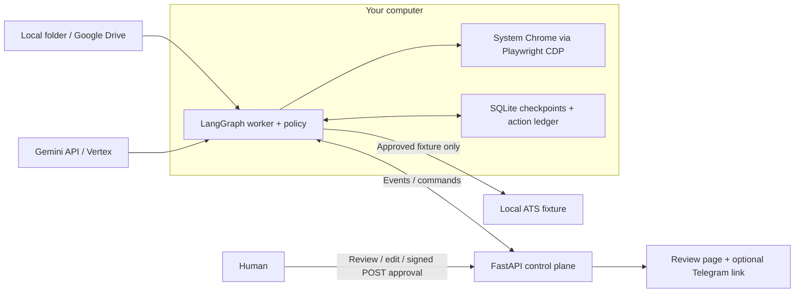

# Hulchul Job-Apply Operator

A browser operator that turns a plain-English job-search goal into reviewed applications.<br>
It reads candidate facts and rules from a local folder or Google Drive.<br>
LangGraph coordinates job selection, form filling, read-back verification and human handoffs.<br>
It pauses with the form intact, then offers a signed review and approval page.<br>
Submission is enabled only on our local fixtures; real employer sites are fill-only.

## Run it in 3 minutes with NO keys

Install **Python 3.13+**, **Google Chrome stable** and Git first. Run from the repo root; setup downloads Python dependencies. No Playwright browser download is needed. Three minutes is a target, dependent on download speed and Chrome startup.

Windows PowerShell:

```powershell
git clone https://github.com/balaastratech/hulchul-operator.git
cd hulchul-operator
powershell -NoProfile -ExecutionPolicy Bypass -File scripts/setup.ps1
$env:ENV_FILE = Join-Path (Get-Location) '.env.demo-missing'
$env:CP_BASE_URL = 'http://127.0.0.1:8790'
.\.venv\Scripts\python.exe scripts/demo_g3.py --headless --no-telegram
```

macOS/Linux (expected to work, **untested**):

```sh
git clone https://github.com/balaastratech/hulchul-operator.git
cd hulchul-operator
bash scripts/setup.sh
export CHROME_PATH='/Applications/Google Chrome.app/Contents/MacOS/Google Chrome'
# Linux instead: export CHROME_PATH="$(command -v google-chrome-stable)"
ENV_FILE="$PWD/.env.demo-missing" CP_BASE_URL=http://127.0.0.1:8790 \
  .venv/bin/python scripts/demo_g3.py --headless --no-telegram
```

Leave `.env.demo-missing` nonexistent. These commands bypass `.env` loading, use a **scripted model**, synthetic data and local fixtures, and generate temporary control-plane secrets. `--no-telegram` disables sending. The demo fills, verifies, edits, rejects stale/replayed approvals, kills/restarts its worker and submits **one fixture application**. Expected final line:

```text
G3 PASS: {"status": "SUBMITTED_VERIFIED", "submissions": 1}
```

Remove `--headless` and add `--auto` to watch Chrome without a keyboard pause. Doctor warnings about missing model credentials, Telegram, cloudflared or Docker do not block this demo. See [system requirements and fixes](docs/SYSTEM_REQUIREMENTS.md).

## Real run

Here “real” means a real model and browser. The default job queue is still synthetic and fixture submission remains the only permitted submission.

1. Setup creates `.env` from `.env.example` only when missing. Edit it locally: use `LLM_PROVIDER=gemini_api` with `GEMINI_API_KEY`, **or** `LLM_PROVIDER=vertex` with `GOOGLE_CLOUD_PROJECT` and `GOOGLE_CLOUD_LOCATION=global`. Vertex needs a billing-enabled project with Vertex AI enabled and ADC from `gcloud auth application-default login`. Default model: `gemini-2.5-flash`. Never commit credentials.
2. Keep `DATA_SOURCE=local_folder`: the default is `sample_data/`, containing a synthetic profile, rules, answer library, resume and queue. `LOCAL_DATA_DIR` selects your own folder with the same schemas. Drive is optional: `DATA_SOURCE=drive_public` with `DRIVE_FOLDER_ID` uses public read access; see [data sources](docs/03-architecture/DATA_SOURCES.md).
3. Run the model-backed fixture flow and open the printed review link on this computer:

```powershell
$env:ENV_FILE = Join-Path (Get-Location) '.env'
.\.venv\Scripts\python.exe scripts/doctor.py --real
.\.venv\Scripts\python.exe scripts/run_real.py --data-source local_folder --no-telegram --goal "Apply to the 3 best-fit roles under my rules"
```

On macOS/Linux use `export ENV_FILE="$PWD/.env"`, set `CHROME_PATH` as above, and use `.venv/bin/python`. Keep headed Chrome visible for login, consent or CAPTCHA handoffs. Answer requests, complete required browser actions yourself, and review before approving. `run_real.py` creates per-run CP secrets; a separately launched control plane requires your own random `CP_SIGNING_KEY` and `CP_WORKER_TOKEN` of at least 32 bytes each.

Optional phone approval: configure `TELEGRAM_BOT_TOKEN` and `TELEGRAM_CHAT_ID`, install cloudflared, then run the same command with `--tunnel` and without `--no-telegram`. This publishes the review service through a temporary tunnel and sends review messages. Telegram and cloudflared are unnecessary for local approval. Docker is optional for deploying the control plane; the browser worker stays on your computer. See [deployment](deploy/README.md).

`--include-public` adds the synthetic public-site queue for fill-only rehearsal. Public listings may close or require login; **approval cannot enable employer submission**. Run artifacts and checkpoints are retained under ignored `runs/`; Ctrl-C retains them for inspection. The launcher expects a fresh state directory on each launch; do not reuse one as a restart command.

## Architecture



The model proposes answers and plans; deterministic code checks authority, sources, navigation, verification, approvals and duplicate actions. [Architecture](docs/03-architecture/ARCHITECTURE.md) and [graph](docs/03-architecture/AGENT_GRAPH.md) explain the boundaries.

## Repo map

| Folder / file | Purpose |
|---|---|
| `src/` | Operator contracts, graph, browser, data, model, policy, ledger and report adapters. |
| `worker/` | Checkpointed worker and outbound control-plane transport. |
| `control_plane/` | FastAPI review pages, signed capabilities, commands, events and SQLite store. |
| `fixtures/` | Local ATS forms, hostile board, login and CAPTCHA stubs. |
| `sample_data/` | Synthetic candidate and fixture job queue for local runs. |
| `sample_data_variant/` | Alternative synthetic candidate for changed-data scenarios. |
| `scripts/` | Setup, doctor, scripted demo and model-backed launch/rehearsal commands. |
| `tests/` | Integration, browser, audit, adversarial, chaos and adapter checks. |
| `evals/` | Evaluation harness and retained baseline/rehearsal results. |
| `evidence/` | Retained synthetic screenshots and raw benchmark evidence. |
| `research/` | Feasibility spike code, separate from production. |
| `deploy/` | Optional container/tunnel setup and phone proof helpers. |
| `docs/` | Design, decisions, measured evidence and submission material; start at [index](docs/00-INDEX.md). |
| `.kiro/` | Agent steering pointer to the common repository instructions. |
| `pyproject.toml`, `pytest.ini` | Pinned dependencies and opt-in live-test configuration. |
| `Dockerfile` | Optional control-plane container; no browser worker inside. |
| `AGENTS.md`, `CLAUDE.md`, `GEMINI.md` | Shared contribution rules and agent entry points. |
| `.env.example`, `.gitignore`, `.gitattributes` | Empty credential template, local artifact exclusions and Git merge rules. |

`pip install .` installs dependencies, not an importable CLI package. Run commands from this checkout: the application imports `src.operator` to avoid Python's standard-library `operator` name.

## Safety model

* T0 reads and T1 local planning are automatic. T2 reversible form input is restricted by the goal and allowlist. T3 external actions require approval for the exact verified snapshot. T4 forbidden actions are blocked. [Policy details](docs/03-architecture/POLICY_AND_SAFETY.md).
* Review GET requests do not approve. Signed, expiring, single-use POST capabilities are bound to run/job/action and the snapshot; edits invalidate old approval. Origin checks reject cross-site requests.
* Only local fixture origins permit submission. Public employers remain fill-only; the model cannot override this restriction.
* The ledger records `SUBMITTING` before clicking. An uncertain crash outcome is `SUBMITTED_UNVERIFIED`, with no automatic second click.
* CAPTCHA, login and legal confirmation require human handoff. EEO and sensitive facts are never guessed. Page instructions are untrusted and injection checks fail closed.

## Measured results

Evidence is dated and scoped; historical reports are not a claim that every finding remains open or that every scenario was rerun after fixes.

| Measurement | Result and evidence |
|---|---|
| Phone approval, 4 Oct 2026 | One human phone approval, one verified fixture submission, replay refused with `409 token_replayed`; seven Gemini calls, reported cost about **INR 3.65**. Other jobs deliberately rejected, run `PARTIAL`. [Proof JSON](docs/05-testing/evidence/phone-proof-2026-10-04.json), [timeline](docs/05-testing/evidence/phone-proof-2026-10-04-timeline.jsonl), [spike report](docs/05-testing/SPIKE_REPORT.md). |
| Public rehearsal baseline | Greenhouse 7 verified / 34 controls, Lever 4 / 62; one additional Greenhouse fill unverified. Ashby unavailable; seven other sites not run. Zero submissions. [Real rehearsal](docs/05-testing/REAL_REHEARSAL.md). |
| Historical S9 / S10 | S9: 53 verified, 63 escalated, 56 skipped, 1 unverified out of 173 controls. S10: 38 correct out of 40 deterministic comparison pairs. These are raw counts, not an overall success rate. [Raw S9](evidence/s9/s9_benchmark_summary.json), [spike report](docs/05-testing/SPIKE_REPORT.md). |
| Independent audit | 28 reproduced findings on an earlier revision, including two critical pre-approval submit paths; later fix waves are recorded separately. [Audit summary](docs/05-testing/AUDIT_SUMMARY.md), [manager integration notes](docs/07-agents/MANAGER_NOTES.md). |
| Crash / adversarial testing | Original matrix: 132 passes and 18 expected failures across 150 cases; 12 recovery liveness failures. Subsequent fixes have focused checks; no complete post-fix chaos matrix claim. [Red-team report](docs/05-testing/REDTEAM_REPORT.md). |

## Limitations

Windows was the execution platform; macOS/Linux setup remains untested. Gemini API-key parity has not been proven to the same extent as Vertex. Public ATS widgets, changed DOMs, unavailable listings, assessments and authentication can block progress. Fill-only rehearsal deliberately withholds custom clicks and uploads and is not a production application-success benchmark. Some raw counts include each radio/checkbox alternative separately. Human gates can remain necessary even with an answer library; salary and legal consent are policy-sensitive. Restart safety favors an uncertain terminal outcome over a duplicate submission. The launcher does not provide a general restart UX. Known adversarial caveats and remaining defects are disclosed in the red-team report. This prototype is not ready for unattended real applications.

## AI assistance and my contribution

Claude Code acted as manager/reviewer; Codex, Antigravity/Gemini and Kiro assisted with implementation, tests, documentation and measured probes. Task notes identify generated work. The human owner decided scope, approved every merge and performed the phone approval. Agents did not independently merge their branches.

**TODO — owner: replace these with your own first-person sentences before submission.**

* **TODO (owner):** “I chose … because …”
* **TODO (owner):** “I personally implemented or changed …”
* **TODO (owner):** “I reviewed and verified …; the most important tradeoff I made was …”

No license has been selected; the owner decides licensing.
