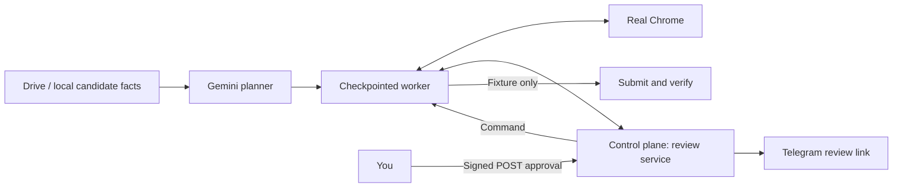

# Hulchul Job-Apply Operator

A browser operator turns a plain-English job-search goal into applications you can review. It reads candidate facts and rules from Google Drive or a local folder, chooses roles, fills forms in real Chrome, and pauses with the form intact. You can review, edit or stop the run; approved submissions go only to local test forms, while real employer sites remain fill-only.



## What you can see in the demo

| Requirement | Command or evidence | What it proves |
|---|---|---|
| Task | `deploy/real_phone_proof.py`; [phone proof](docs/05-testing/evidence/phone-proof-2026-10-04.json) and [timeline](docs/05-testing/evidence/phone-proof-2026-10-04-timeline.jsonl) | Drive + Gemini + Chrome + Telegram; one human approval, one verified fixture submission, replay refused |
| Variation | `scripts/plan_only.py`; [variation test](tests/test_evals.py) | Change candidate rules and rerun the same goal; the shortlist changes without code changes |
| Failure and recovery | `scripts/demo_g3.py`; [crash-window tests](tests/integration/test_g3_click_to_submit.py) | Restart without refilling or duplicate submission; an uncertain submit intent remains unverified |
| Human control | [human route tests](tests/control_plane/test_human_routes.py), [login/CAPTCHA fixtures](tests/e2e/test_e2e_fixtures.py) | Review, edit and stale/replayed approval refusal; human handoff instead of solving a challenge |
| Real unseen forms | [public rehearsal](docs/05-testing/REAL_REHEARSAL.md) and [raw results](evals/real_forms/artifacts/latest/results.json) | A constrained historical fill-only baseline, with blockers and unverified values disclosed |

## Architecture

1. Drive or a local folder supplies profile, rules, answers, resume and job queue; a hash identifies the exact input snapshot.
2. Gemini proposes the goal, shortlist and answers grounded in those candidate facts.
3. LangGraph, a resumable workflow engine, runs the worker and saves its progress in SQLite.
4. Playwright controls a separate Chrome process over CDP, Chrome's debugging connection; Chrome can survive a worker crash.
5. The control plane is a FastAPI web service that stores review snapshots, messages and commands.
6. Telegram delivers a link to the review page, where you see read-back values and can edit or stop.
7. Approval is a signed, expiring, single-use POST tied to that exact snapshot; editing invalidates it.
8. The worker records submit intent before clicking a fixture, then verifies confirmation; uncertain recovery never repeats the click.

[Design](docs/03-architecture/ARCHITECTURE.md), graph and [decisions](docs/04-decisions/DECISION_LOG.md) give details.

## Quick start

Prerequisites: Python **3.13+**, Google Chrome stable and Git. Run from the checkout. Windows was tested; macOS/Linux setup is provided but untested. Chrome is installed separately; `playwright install` is unnecessary.

```powershell
git clone https://github.com/balaastratech/hulchul-operator.git
cd hulchul-operator
powershell -NoProfile -ExecutionPolicy Bypass -File scripts/setup.ps1
.\.venv\Scripts\Activate.ps1
python scripts/doctor.py
```

On macOS/Linux: `bash scripts/setup.sh`, activate `.venv/bin/activate`, and set `CHROME_PATH` to your Chrome executable. Setup installs the pinned dependencies and copies `.env.example` only when `.env` is missing. Doctor reports required failures and optional warnings without printing credentials. See [requirements and troubleshooting](docs/SYSTEM_REQUIREMENTS.md).

The template contains empty credential slots. Choose `LLM_PROVIDER=gemini_api` plus `GEMINI_API_KEY`, or `vertex` plus `GOOGLE_CLOUD_PROJECT` and application-default credentials from `gcloud auth application-default login`; use `GOOGLE_CLOUD_LOCATION=global`. Default model: `gemini-2.5-flash`. `DATA_SOURCE=local_folder` uses the bundled fictional Aarav Mehta; `drive_public` plus `DRIVE_FOLDER_ID` reads a public synthetic folder. Telegram needs `TELEGRAM_BOT_TOKEN` and `TELEGRAM_CHAT_ID`; phone links also need cloudflared. A standalone control plane needs random `CP_SIGNING_KEY` and `CP_WORKER_TOKEN` of at least 32 bytes each; launchers generate temporary secrets. Never commit `.env` or downloaded candidate data.

**Task and phone approval** (configured model, Drive, Telegram and cloudflared):

```powershell
python deploy/real_phone_proof.py --state-dir runs/phone-demo-01 --data-source drive_public
```

Use a fresh state folder. When prompted, open Telegram, review and approve. Expected: `PHONE PROOF PASS` with one phone approval, one fixture submission and replay refused. The [recorded proof](docs/05-testing/evidence/phone-proof-2026-10-04.json) ended `PARTIAL` because other selected jobs were deliberately rejected; it is not a claim that every selected job succeeded.

**Variation** (configured model; Drive optional):

```powershell
python scripts/plan_only.py --goal "Apply to the 3 best-fit roles under my rules" --data-source drive_public
```

Expected: `SHORTLIST`, `QUARANTINED POSTS`, `SKIPPED POSTS` and usage counts. Edit only the synthetic Drive rules, then repeat; compare selected roles and reasons. Use `--data-source local_folder` for bundled data. The planning command does not fill or submit.

**Failure and recovery** (scripted model, no keys or Telegram):

```powershell
$env:ENV_FILE = Join-Path (Get-Location) '.env.demo-missing'
$env:CP_BASE_URL = 'http://127.0.0.1:8790'
python scripts/demo_g3.py --headless --no-telegram --crash before_claim
python scripts/demo_g3.py --headless --no-telegram --crash after_claim
```

Leave `.env.demo-missing` nonexistent. Expected current final line for both commands:

```text
G3 PASS: {"status": "SUBMITTED_VERIFIED", "submissions": 1}
```

**Current launcher limitation:** it parses `--crash` but always runs `before_claim`. The `after_claim` recovery outcome is proven by the separate opt-in test below: `SUBMITTED_UNVERIFIED`, zero fixture submissions, no repeated click. Do not label the second launcher command as that proof. Remove `--headless` and add `--auto` to watch Chrome without a keyboard pause.

```powershell
$env:RUN_G3 = '1'
python -m pytest tests/integration/test_g3_click_to_submit.py -m live -q
```

This opt-in command exercises local fixtures and Chrome with a scripted model. For a local model-backed review without phone messaging, use `python scripts/run_real.py --data-source local_folder --no-telegram --goal "Apply to the 3 best-fit roles under my rules"`. Reset `ENV_FILE` to your local `.env` before model-backed runs. [Deployment](deploy/README.md) explains the split service and worker.

## Safety model

Hard-coded controls decide permission: T0 reads and T1 planning are automatic; T2 reversible input is constrained by your goal and allowed sites; T3 submission needs exact-snapshot approval; T4 forbidden actions are blocked. Untrusted job instructions are quarantined before ranking. Sensitive, legal and EEO answers are never guessed. GET links cannot approve; approval uses single-use signed POST capabilities. The ledger records `SUBMITTING` before the click and permits verification only on uncertain restart. CAPTCHA and login require human handoff. Employer submission is disabled regardless of model output or human approval.

The model adapts role ranking, field-to-fact mapping, wording and website formats. A rejected input gets one bounded repair attempt using the browser error; unresolved questions go to you. [Policy details](docs/03-architecture/POLICY_AND_SAFETY.md).

## Tests and measurements

```powershell
python -m pytest -q
```

The final cleanup run on 4 Oct 2026 passed: **710 passed, 104 skipped, 8 deselected, 2 xfailed in 64.60 seconds** (exit 0). The full offline suite ran once.

The default suite excludes live services and skips opt-in browser/chaos checks. Passing offline checks do not establish universal ATS coverage.

| Dated measurement | Result |
|---|---|
| Independent audit | [28 findings](docs/05-testing/AUDIT_SUMMARY.md): 2 critical, 14 high, 11 medium, 1 low on an earlier revision; critical submit paths subsequently fixed |
| Historical crash/adversarial matrix | [132 passes, 18 strict expected failures across 150 cases](docs/05-testing/REDTEAM_REPORT.md); no complete post-fix matrix rerun claimed |
| Real phone proof | [One human approval, one verified fixture submission, replay `409 token_replayed`](docs/05-testing/evidence/phone-proof-2026-10-04.json); reported INR 3.65, seven Gemini calls |
| Public rehearsal | [Greenhouse 7/34 controls verified, Lever 4/62](docs/05-testing/REAL_REHEARSAL.md); one extra Greenhouse fill unverified, Ashby unavailable, seven sites not run; zero submissions |
| Historical S9/S10 | 53 verified + 63 escalated + 56 skipped + 1 unverified = 173 controls; S10 38/40 comparisons |

## Honest limits and next

No claim of real employer submissions, CAPTCHA solving, every ATS, unattended operation or a working WhatsApp integration (stub only). Public rehearsal withheld clicks, custom widgets and uploads; it predates browser hardening. Some benchmarks count radio/checkbox alternatives separately. Windows was tested; other platforms and live Gemini API-key parity remain unproven. Changed forms, login, unavailable listings and assessments can block progress. Worker recovery favors an honest uncertain outcome over duplicate submission; the launcher lacks a general restart interface. Historical estimator costs are not billing evidence. The crash CLI issue above remains open.

Next: dedicated inbox/OTP handling, account creation, website adapters, an answer-library editor and remote browser operation. See [future scope](docs/06-roadmap/FUTURE_SCOPE.md) and the video limits.

## AI assistance and my contribution

Claude, Codex, Antigravity, Kiro and Gemini assisted with coding, tests, review and documentation. The user directed planning, scope and design choices, approved merges, verified results and performed the human approval in the phone proof. The runtime uses Gemini for proposals; deterministic code enforces safety.


## Repo map

```text
src/                  Operator models, graph, browser, data, planner, policy and ledger
worker/               Checkpointed worker and control-plane transport
control_plane/        Review web service; cited historical prefetch evidence under spikes/
deploy/               Container/tunnel instructions and phone-proof commands
fixtures/             Local forms, hostile posts, login and CAPTCHA stubs
sample_data*/         Fictional candidate and alternate rules
scripts/              Setup, doctor, planning, demos and guarded public rehearsal
tests/                Offline checks and opt-in integration/crash checks
evals/                Evaluation cases and retained public rehearsal artifacts
docs/                 Architecture, decisions, audit and test evidence, engineering note
```

See the [contribution note](CONTRIBUTING.md). `pip install .` installs dependencies; commands run from this checkout using `src.operator` imports. No license has been selected.
