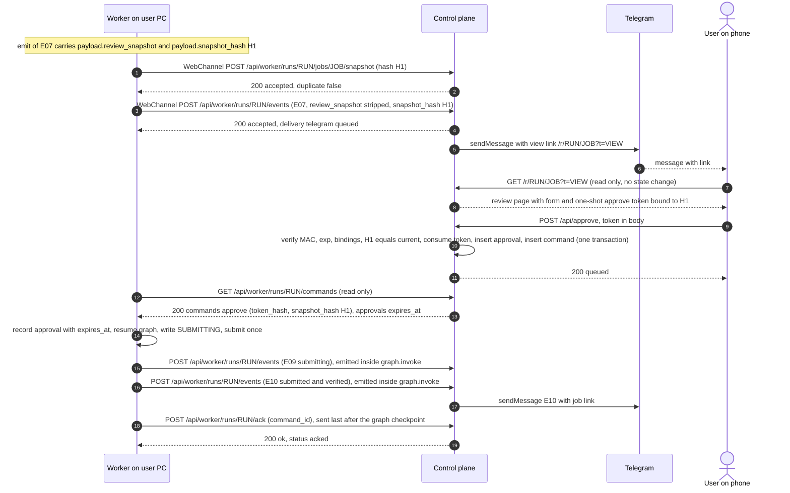
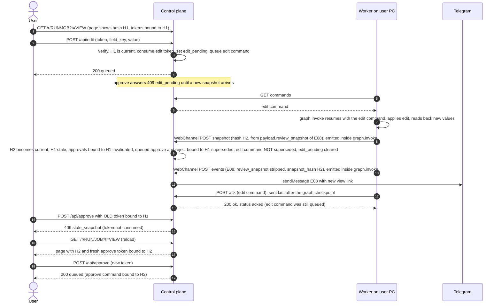

# Control plane API — routes, authentication, tokens and persistence

Historical interface design, recorded 2026-10-03. EXISTING and PROPOSED labels describe that design baseline, not a current conformance claim. Executable routes and tests are the implementation reference.

## 1. Overview and trust boundaries

```
 Phone / laptop (human)                 Control plane (FastAPI, SQLite)                 Worker (user's PC)
 ──────────────────────                 ───────────────────────────────                 ──────────────────
 GET  /r/..?t=VIEW   ───HTTPS──────────►  read-only pages, evidence, SSE
 POST /api/*  (token in body) ─HTTPS───►  verify token → atomic consume → Command row
 Telegram app  ◄── Bot API (outbound from CP: sendMessage, getUpdates long-poll)
                                          ◄───HTTPS, OUTBOUND ONLY, Bearer────────────  GET commands · POST ack · POST heartbeat
                                          ◄────────────────────────────────────────────  POST events · POST snapshot · POST evidence
```

Rules that hold for every route:
1. **The worker only makes outbound calls.** The CP never connects to the worker. All worker-facing routes are under `/api/worker/` and the CP has no route that triggers an action on the worker except by queueing a `Command` that the worker later polls.
2. **GET never changes state (D-008, AGENTS.md rule 5).** This includes the worker's `GET commands` (see the lifecycle decision in 3.2) and the review page that embeds one-shot tokens (minting is a pure computation, section 5.3). **A GET handler writes nothing persistent, full stop**: no table row, no column (for example `runs.channel_unreachable`, `last_polled`, "last viewed"), no file. Rate-limit and failed-auth counters, SSE subscriber registries and presence information live **in memory only** (9.1, 4.3, 7.2).
3. **Mutations are POST only**, and human POSTs carry their capability token in the **request body**, never in the URL or a header the browser adds by itself.
4. **No secrets in URLs owned by the worker.** The three worker URLs have no query string (enforced by `HttpTransport`); the CP therefore never relies on query parameters on `/api/worker/*`.
5. **Fail closed.** Missing or short `CP_SIGNING_KEY`, missing worker bearer secret, or missing `CP_BASE_URL` in non-dev mode: the process exits before binding a port.

### 1.1 Three auth classes

| Class | Who | Credential | Where it is sent | Scope |
|---|---|---|---|---|
| (a) Worker bearer | the browser worker on the user's PC and its worker-side channel adapter | static secret `CP_WORKER_TOKEN` (**NEW, not in `.env` yet → OQ-CP-1, OPEN**) | `Authorization: Bearer <CP_WORKER_TOKEN>` on every `/api/worker/*` request. The worker reads the full header value from its env `WORKER_AUTHORIZATION` (`main.py`), i.e. `Bearer <CP_WORKER_TOKEN>` | all runs (v1 is single-worker, single-user). The URL path still pins every call to one `run_id` |
| (b) Human capability tokens | the user's browser | HMAC-SHA256 tokens signed with `CP_SIGNING_KEY` (already in main `.env`; never printed) | `view` token: URL query `?t=` on GET pages; `act` and `run` tokens: JSON/form **body** field `token` on POST; `view` token on SSE: `Authorization` header (4.3) | `view`: read one run or one job · `act`: exactly one action on one job and snapshot · `run`: pause/resume/cancel of one run |
| (c) Telegram chat allowlist | the Telegram inbound updates read by the CP | `TELEGRAM_CHAT_ID` (allowlist; already in main `.env`) | the `chat.id` of each update | may only answer an open `ask_user` question (section 7.3) |

Configuration comes from the single `.env` at the path in `ENV_FILE` (`C:\Balaastra\hulchul-operator\.env`) via `python-dotenv` (`load_dotenv(os.environ.get("ENV_FILE", ...), override=False)`), so container-injected environment variables win. Values are never printed, logged or copied.

| Variable | Secret? | Status | Use |
|---|---|---|---|
| `CP_SIGNING_KEY` | yes | in `.env` | HMAC key for human tokens; >= 32 bytes |
| `CP_SIGNING_KEY_PREVIOUS` | yes | optional, NEW | verify-only key during rotation (5.7) |
| `CP_WORKER_TOKEN` | yes | **NEW, must be created (OQ-CP-1)** | worker bearer secret; must be >= 32 random bytes |
| `TELEGRAM_BOT_TOKEN`, `TELEGRAM_CHAT_ID` | yes / no | in `.env` | Telegram channel and allowlist |
| `CP_BASE_URL` | no | NEW | public HTTPS origin used in links and the Origin check (for example the tunnel URL) |
| `CP_DB_PATH` | no | NEW | SQLite file; default `data/control_plane.sqlite` (git-ignored, Docker volume) |
| `CP_ENV` | no | NEW | `prod` (default) or `dev`. Only `dev` allows the unauthenticated-loopback worker switch below |
| `CP_DEV_ALLOW_UNAUTH_WORKER` | no | NEW | `1` lets tests call `/api/worker/*` without bearer; refused unless `CP_ENV=dev` **and** `CP_BASE_URL` is `http://127.0.0.1` or `localhost` |

Why there is no "loopback peer is trusted" shortcut: a tunnel such as cloudflared connects to the CP **from loopback**, so a peer-address check would silently make the public route unauthenticated. The bearer is therefore required on every worker route in `prod`, whatever the peer address. (The worker's own rule, "remote origins need HTTPS plus Authorization; loopback may skip Authorization", is a client-side minimum, not a server-side one.)

### 1.2 Cross-cutting HTTP rules

- JSON everywhere except the HTML pages and the SSE stream. Error bodies are `{"error": "<code>", "detail": "<short text, no secrets>"}`.
- **No redirects from any `/api/*`, `/events/*`, `/evidence/*` or `/healthz` route.** `redirect_slashes` is disabled; a trailing-slash URL is a 404. (`HttpTransport` raises on any redirect.) HTTP→HTTPS redirection is the proxy's job; the worker is configured with `https://` URLs directly.
- Worker JSON responses are far below the worker's 2 MB cap (`read(2_000_001)`, > 2,000,000 bytes raises). The CP caps `GET commands` at 50 commands and 64 KB `value` per command (see 3.1).
- All responses: `Cache-Control: no-store`. HTML pages add `Referrer-Policy: no-referrer`, `X-Robots-Tag: noindex, nofollow`, `X-Content-Type-Options: nosniff`, `Content-Security-Policy: default-src 'self'; img-src 'self'; frame-ancestors 'none'; form-action 'self'; base-uri 'none'`, no third-party resources. All dynamic values are HTML-escaped (template autoescape on).
- No CORS headers are ever emitted.
- Request size caps (413 if exceeded): heartbeat/ack 4 KB · command-creating POST 64 KB · events 256 KB · snapshot 1 MB · evidence 3 MB.
- Run and job ids must match `^[A-Za-z0-9_.-]{1,64}$`; anything else is a 404 (prevents path tricks).

---

## 2. Worker-facing routes

### 2.1 What the worker code fixes (verified against `worker/transport.py` and `worker/main.py`)

| Fact in the code | Consequence for the server |
|---|---|
| `HttpTransport(commands_url, acknowledgement_url, heartbeat_url, authorization=None)`. **No path is hardcoded**; `main.py` takes three CLI URLs | path names are ours to choose; this document chooses them (**PROPOSED**, the worker just needs the three full URLs on its command line) |
| All three URLs must share one origin (`scheme, host, port`) | one CP origin serves all worker routes |
| Non-loopback origin requires `https` **and** a non-empty `authorization`; loopback hosts are `localhost`, `127.0.0.1`, `::1` | CP in prod is HTTPS-only behind the proxy and requires the bearer |
| No URL may have a query string | run id and everything else travels in the **path** or body |
| `poll(run_id)` performs `GET commands_url` and sends **no run id**; the run is implied by the URL. It then checks `command.run_id == run_id` for every command and raises `PermissionError` otherwise | the commands URL is per run: `.../runs/{run_id}/commands`; the CP must never return another run's command (a single foreign command would make the worker's `tick` fail forever) |
| `acknowledge(command_id)` performs `POST acknowledgement_url` with JSON `{"command_id": "..."}` | per-run URL; run comes from the path |
| `heartbeat(run_id, status)` performs `POST heartbeat_url` with JSON `{"run_id": "...", "status": "..."}` | per-run URL; body `run_id` must equal the path run (else 400); `status` is `run.status` (a `RunStatus` value, defaulting to `QUEUED`) |
| Request headers: `Accept: application/json`; `Authorization: <WORKER_AUTHORIZATION value>` when configured; for POST also `Content-Type: application/json` with a UTF-8 body made by `json.dumps(payload)` (default separators `", "` and `": "`, `ensure_ascii=True`, so non-ASCII arrives as `\uXXXX` escapes). The CP parses JSON and must never compare body bytes | server accepts exactly these; it must not require any other header |
| Redirects are blocked (`NoRedirect`) and a response URL on another origin raises | the CP never answers worker routes with 3xx |
| Response body read is capped at 2,000,000 bytes; `json.loads` of a non-empty body; **an empty body returns `None`** | ack/heartbeat may return any JSON or nothing. **`GET commands` must always return a JSON object with a `commands` array**: an empty body would make `result["commands"]` raise `TypeError`, which `Worker.run_forever` does **not** catch (it catches only `OSError`, `ValueError`, `PermissionError`), crashing the worker |
| Failure handling (`run_forever`): `OSError` (includes every non-2xx `HTTPError`, timeouts, connection errors), `ValueError` (bad JSON, pydantic `ValidationError`) and `PermissionError` are retried with exponential backoff (poll interval doubling, capped at 30 s). **There is no fatal HTTP status**; a persistent 401/403/404 just backs off forever. `KeyError`/`TypeError` crash the worker | the server must answer a well-formed `200` JSON shape or a non-2xx; never a 2xx with a different shape. Auth failures are visible only in CP logs and in a stale heartbeat (E15) |
| `tick()` order: `heartbeat` → `poll` → `handle` each command serially; `handle` runs the graph **then** `acknowledge`; `_control_command()` additionally calls `poll` between atomic fill actions and picks only `pause`/`cancel` | `tick()` sends the heartbeat first, **but the first `poll` can happen earlier**: `Worker.start_or_resume` runs `graph.invoke`, whose `_control_command()` calls `transport.poll`, before any heartbeat and outside `run_forever`'s `try/except`. There a `404` becomes `HTTPError` (an `OSError`) that escapes `main()` and kills the worker. So **`GET commands` for a run the CP has not seen yet must answer `200 {"commands": [], "approvals": {}}`, never 404** (2.2 W1). Poll frequency can be high (per fill action), so the commands route must be cheap and rate-limited generously; an unacked command keeps being returned until acked (at-least-once) |
| Client timeout 10 s | handlers answer within a second; Telegram delivery is asynchronous and never blocks a worker request |
| **EXISTING, MANDATORY.** `HttpTransport.poll` looks up an expiry for **every** `approve` command: first `item.get("approval_expires_at")` (wrapper form), else `result.get("approvals", {})[command_id]["expires_at"]`. If the value is not a string it raises `ValueError("approval expiry metadata is required")`; `datetime.fromisoformat` is applied and a **naive** result raises `ValueError("approval expiry must be aware")`. The value is kept in `HttpTransport.approvals` and exposed by `HttpTransport.approval_expiry(command)`. `Worker.handle` for `approve` then takes that expiry (`None` → `PermissionError("remote approval requires verified expiry metadata")`), and calls `ledger.approval_registered(...)` / `ledger.record_approval(run, job, token_hash, snapshot_hash, expiry)` before resuming the graph | **Every `approve` command in a `GET commands` response MUST have a timezone-aware ISO-8601 expiry** in the `approvals` sibling. The CP always writes the explicit `+00:00` offset (never `Z`): `datetime.fromisoformat` accepts a trailing `Z` only on Python >= 3.11, and the repo's `pyproject.toml` requires Python >= 3.13, but writing `+00:00` stays safe if a worker ever runs on an older interpreter. If one is missing or naive, `poll` raises `ValueError` for the **whole batch**: no command of that poll is handled (including `pause`/`cancel` in the same batch, and `_control_command()` which also calls `poll`), `run_forever` backs off (poll interval doubling up to 30 s) and the worker stalls until the CP fixes the response. OQ-CP-3 is therefore **CLOSED** (worker code already implements it; verified against worker HEAD `42a0ccc`, commit `4a91c90`) |
| `poll` also accepts each `commands` item in a **wrapper form** `{"command": {Command...}, "approval_expires_at": "<aware ISO>"}` (`Command.model_validate(item.get("command", item))`) | Allowed by the worker, **not used by the CP** (N4): the CP always returns the **plain form**: each item is a bare `Command` object (so it has no room for extra keys, `additionalProperties: false`) and the expiry travels in the `approvals` sibling. A reviewer must not expect `approval_expires_at` in the items |

### 2.2 The three routes the worker already uses (EXISTING behaviour; path names PROPOSED)

All three: `Authorization: Bearer <CP_WORKER_TOKEN>` required (401 `missing_bearer` / `invalid_bearer`, compared in constant time).

**Unknown-run rule (normative).** Every authenticated worker route except ack **upserts the run**: heartbeat (W3), events (W4), snapshot (W5) and evidence (W6) create the run row if `{run_id}` is new. Two routes never create it: `GET commands` (W1), because a GET writes nothing, answers an unseen run with `200 {"commands": [], "approvals": {}}`; and ack (W2), which answers `404 command_unknown` for any command id it does not hold (an unseen run holds none). No worker route answers `404 run_unknown`, because the worker's first `poll` can precede its first heartbeat and a 404 there kills it (2.1).

#### W1 `GET /api/worker/runs/{run_id}/commands`  (EXISTING call, PROPOSED path)
- Request: no body, no query string. Headers as in 2.1.
- Response `200`:
  ```json
  {
    "commands": [ { "command_id": "cmd_...", "run_id": "RUN", "job_id": "JOB", "action": "approve",
                   "token_hash": "<64 hex>", "snapshot_hash": "<64 hex>", "field_key": null, "value": null } ],
    "approvals": { "cmd_...": { "expires_at": "2026-10-03T12:30:00+00:00" } }
  }
  ```
  - `commands`: an array of `Command` objects exactly as in `Command.schema.json` (`additionalProperties: false`, so **no extra keys inside a command**). Possibly empty, never omitted. Only commands of `{run_id}` with status `queued`, ascending by server sequence, at most 50. `approve` commands always carry `job_id`, `token_hash`, `snapshot_hash` (the schema's own validator requires them); `edit`/`answer` always carry `job_id` and `field_key`.
  - `approvals` (**EXISTING and MANDATORY** for approve commands; verified in `HttpTransport.poll`): a top-level sibling object keyed by `command_id`. **Every `approve` command in `commands` MUST have an entry** `{"expires_at": "<timezone-aware ISO-8601>"}`, otherwise `poll` raises `ValueError` and the whole poll fails (section 2.1), stalling the worker. The timestamp must be timezone-aware: the CP always writes UTC with the explicit `+00:00` offset; a naive timestamp is rejected by the worker. It is the expiry the worker passes to `ledger.record_approval(run, job, token_hash, snapshot_hash, expires_at)`; it is the `exp` of the action token that produced the approval ("verified metadata": the CP read it from the signature-checked token; the raw token is never sent). The object is `{}` when there is no approve command (the worker tolerates absence via `result.get("approvals", {})`, but the CP always sends the key). The CP includes the entry even if the timestamp is already in the past (slow worker): the worker's ledger decides what an expired approval means (OQ-CP-8); omitting it would stall the worker instead. Entries for non-approve commands are ignored by the worker and are not sent.
- Read-only: the handler performs no write. It does not update a "last polled" timestamp, does not create the run and does not mark anything delivered.
- **Unseen run**: if the CP holds no row for `{run_id}` (fresh database, first run, poll before the first heartbeat), the answer is `200 {"commands": [], "approvals": {}}`. Never `404`, never an empty body (2.1, 2.2 unknown-run rule).
- Errors: `401` bearer; `429`. There is no `404` on this route.

#### W2 `POST /api/worker/runs/{run_id}/ack`  (EXISTING call, PROPOSED path)
- Request: `{"command_id": "cmd_..."}` (exactly one key; extra keys are ignored).
- **Ordering fact (`Worker.handle`)**: the worker runs `graph.invoke(...)` first (which may already have POSTed a new snapshot and events, for example H2 and E08 after an edit) and calls `acknowledge` **last**. The ack can therefore arrive after the CP has already processed a snapshot or E14 that touched the command's status.
- Response `200` for **every** command id that belongs to `{run_id}`, whatever its status (idempotent, never 404 for a command of this run):
  | Command status when ack arrives | Effect | Response body |
  |---|---|---|
  | `queued` | `queued → acked`, sets `acked_at`; for an `approve`, the matching `approvals` row becomes `consumed_by_worker` | `{"ok": true, "already_acked": false, "status": "acked"}` |
  | `acked` | none (lost response retried) | `{"ok": true, "already_acked": true, "status": "acked"}` |
  | `superseded` or `expired` | none; the status stays as it is (terminal), the ack is accepted and ignored | `{"ok": true, "already_acked": false, "status": "superseded"}` or `"expired"` |
  A `404` here would raise `HTTPError` (an `OSError`) inside `acknowledge`, abort the rest of the poll batch after the command was already marked `DONE` locally, and back off; that is why a superseded or expired command must still ack with `200`.
- Errors: `404 command_unknown` only if the id does not exist **or belongs to another run** (same response, no information leak); `401`; `422` if `command_id` is missing.

#### W3 `POST /api/worker/runs/{run_id}/heartbeat`  (EXISTING call, PROPOSED path)
- Request: `{"run_id": "RUN", "status": "RUNNING"}`. `run_id` must equal the path (else `400 run_mismatch`). `status` must match `^[A-Z_]{1,32}$` (stored verbatim as `last_status`; expected values are the `RunStatus` enum: `QUEUED RUNNING COMPLETED PARTIAL BLOCKED CANCELLED`).
- Response `200`: `{"ok": true, "server_time": "<ISO-8601 Z>", "channel_unreachable": false}` (today's worker ignores the body; the extra fields are informational).
- Effect: **upserts the run row** (so no separate "register run" route exists) and sets `last_heartbeat_at`. It carries no candidate data and no capability. A run id first seen here is created with status taken from the body (same upsert as W4-W6; an event-, snapshot- or evidence-created run starts with `last_status = QUEUED` until a heartbeat says otherwise).
- Errors: `401`, `400`, `422`.

**Run registration route: not needed (decided).** Runs are created by the first authenticated heartbeat, event, snapshot or evidence POST (unknown-run rule above); a GET or an ack never creates one. The user starts runs by launching the worker (`--run-id`, `--goal`), so there is no inbound "start run" call.

### 2.3 Event, snapshot and evidence routes

The `WorkerTransport` protocol has only poll/ack/heartbeat. Events and snapshots travel through `ChannelPort.emit(Event)` (`ports.py`), which lives in the worker process. The channel adapter provides the worker-side implementation (`src/operator/channels/web.py`, a `ChannelPort` adapter) which performs the three POSTs below with the **same origin and the same bearer**. The composition must (1) construct that channel in the worker's `Services`, and (2) follow the payload conventions in 2.4.

#### W4 `POST /api/worker/runs/{run_id}/events`  (PROPOSED)
- Request body: an `Event` exactly as `Event.schema.json` (`event_id` E01..E15, `run_id`, optional `job_id`, `message`, `payload`, `links`, `created_at`). `run_id` must equal the path (else `400 run_mismatch`).
- Idempotency: the schema has **no per-instance event id** (`event_id` is the E-code). The CP therefore derives `dedup_key = sha256(canonical_json(event))` where canonical JSON = sorted keys, separators `,` `:`, `ensure_ascii=false`, UTF-8. A byte-identical resend (the adapter's retry after a timeout) is a duplicate. For E07/E08 a second dedup key `(run, job, event_id, payload.snapshot_hash)` additionally prevents a second Telegram message for the same snapshot. **OPEN (OQ-CP-4)**: cleaner is an `event_uid` field in the `Event` contract (B2 change, worker).
- Response `200`: `{"accepted": true, "duplicate": false, "seq": 42, "delivery": {"web": "available", "telegram": "queued"}}`. Duplicate: `{"accepted": true, "duplicate": true, "seq": 42, "delivery": {...}}`. `delivery.telegram` is `queued` (asynchronous; the CP never blocks the 10 s worker timeout on Bot API calls) or `disabled`.
- The CP ignores any `links` sent by the worker beyond storing them for display of non-secret labels: **the CP mints every link itself** because it holds the signing key and knows `CP_BASE_URL`; the worker never sees a token.
- Side effect: upserts the run row (unknown-run rule, 2.2). The run is created even if the event is later rejected only by the preconditions below.
- **E07/E08 preconditions**: `payload.snapshot_hash` must equal the stored **current** snapshot hash for `(run, job)`, else `409 snapshot_unknown`. The hash becomes current only through W5, which the worker-side `WebChannel` calls **before** W4 using `payload.review_snapshot` (2.4). This guarantees a Telegram link is never created for a hash the CP cannot bind a token to. The event body received on W4 carries `payload.snapshot_hash` but **not** `payload.review_snapshot` (the adapter strips it, 2.4), so the 256 KB event cap holds and snapshot data is stored once.
- **E15 is never posted by the worker** (it is offline by definition); the CP generates it (7.1). A worker-posted E15 is rejected with `422 event_not_allowed` and stored nowhere, so a worker can never fake an outage notice.
- Errors: `400`, `401`, `409 snapshot_unknown`, `413`, `422` (schema violation, `payload_invalid`, `event_not_allowed`), `429`. No `404`.

#### W5 `POST /api/worker/runs/{run_id}/jobs/{job_id}/snapshot`  (PROPOSED)
`ReviewSnapshot.schema.json` has **no** `snapshot_hash`, `run_id` or `job_id` (the hash is `ReviewSnapshot.content_hash()`, which excludes `screenshots`). The body is therefore an envelope:
```json
{ "snapshot_hash": "<64 hex, = ReviewSnapshot.content_hash()>",
  "snapshot": { "fields": [...], "uploads": [...], "generated_texts": {...}, "unanswered": [...], "screenshots": [...] } }
```
- The CP validates `snapshot` against `ReviewSnapshot.schema.json`, **recomputes** the content hash with the same canonicalisation and requires equality with `snapshot_hash`, else `422 hash_mismatch`. The CP does not trust the worker's claimed hash. Recomputation must **normalise through the model first**: load `snapshot` into the `ReviewSnapshot` model (or, before the contracts merge, fill the schema defaults by hand: `escalated`, `generated`, `reason`, `intended` and the other defaulted keys) and dump it the way `ReviewSnapshot.content_hash()` does (`model_dump(mode="json")`). Hashing the raw request dict would give a spurious `422 hash_mismatch` for a worker that omits defaulted keys. After the contracts merge the CP calls `ReviewSnapshot.content_hash()` directly. Algorithm (same as the worker's): dump without `screenshots`, `fields` and `uploads` sorted by `field_key`, `unanswered` sorted, sorted keys, compact separators, `ensure_ascii=false`, SHA-256 hex.
- Side effect: upserts the run row (unknown-run rule, 2.2).
- Semantics:
  - New hash for `(run, job)`: store it as **current**, mark the previous current snapshot **stale**, invalidate any approval bound to an older hash (`approvals.status = invalidated`), supersede any still-`queued` **`approve` or `reject`** command bound to an older hash (never delivered again; such a command is a decision about content that no longer exists), and clear the job's `edit_pending` flag. **`edit` commands are never superseded by a snapshot**: an `edit` carries `field_key` + `value`, not a decision about a hash, and the snapshot H2 that arrives while the worker is handling an edit is usually the very result of that edit (the worker posts H2 inside `graph.invoke` and acks the edit last, 2.2 W2). The edit command stays `queued` until its ack, is still returned by `GET commands` if the worker crashes before the ack (the worker's own `commands` table skips a `DONE` one and just re-acks), and is then acked normally. `answer`, `handoff_done`, `skip`, `pause`, `resume`, `cancel` are likewise unaffected. Response `200 {"accepted": true, "duplicate": false, "stale_hash": "<old or null>", "invalidated_approvals": 1, "superseded_commands": 0}`.
  - Same hash as current: `200 {"accepted": true, "duplicate": true, ...}`; the `screenshots` list may be refreshed because it does not affect the hash. No approval changes.
  - A hash that is already stale (an older state reappears): accepted and becomes current again (an undone edit), approvals bound to it stay invalidated and must be re-approved.
- `screenshots` entries are **worker-local paths** (`ReviewSnapshot.screenshots: list[str]`). The CP never serves or opens a path. Images reach the review page through W6; the page shows an evidence image only if the entry's base name was uploaded.
- Errors: `401`, `413`, `422 schema_invalid|hash_mismatch`.

#### W6 `POST /api/worker/runs/{run_id}/evidence`  (PROPOSED)
`HttpTransport._request` can only send a JSON body, so evidence is base64 in JSON:
```json
{ "job_id": "JOB", "name": "fill_01.png", "sha256": "<64 hex of the decoded bytes>", "mime": "image/png", "content_b64": "<<= 3 MB total request>" }
```
- Accepted MIME: `image/png`, `image/jpeg`, `image/webp`. The decoded size is at most 2 MB. The CP recomputes SHA-256 and rejects a mismatch (`422 hash_mismatch`). Idempotent on `(run, job, sha256)`.
- Response `200`: `{"accepted": true, "evidence_id": "ev_<random>", "duplicate": false, "expires_at": "<ISO Z>"}`. Stored with a TTL (section 9.3). Synthetic data only.
- The upload is best-effort; a missing image never blocks approval but the page shows "screenshot not available".
- Side effect: upserts the run row (unknown-run rule, 2.2).

### 2.4 Payload conventions the CP reads (PROPOSED, OPEN — OQ-CP-7)

`Event.payload` is free-form in the schema. To build pages and messages the CP needs these keys, and the producer must supply them:

| Event | Required payload keys read by the CP | Notes |
|---|---|---|
| E01 | `goal` (string), optional `data_snapshot_hash`, `files` (list of names) | |
| E02 | `chosen` (list of `{job_id, title, company, reasons}`), `skipped` (list of `{job_id, reason}`) | |
| E03 | `excerpt` (string, raw; the CP escapes it), `rule` | job quarantined |
| E04, E05 | `site`, `observed` (short text), optional `page_kind` | opens a handoff gate |
| E06 | `field_key`, `label`, `why`, `suggestions` (list of strings) | opens an ask gate for that field |
| E07, E08 | **`review_snapshot`** (a full `ReviewSnapshot` object, exactly `ReviewSnapshot.schema.json`), **`snapshot_hash`** (64 hex, must equal `ReviewSnapshot.content_hash()` of `review_snapshot`), `counts` (`filled`, `total`, `need_user`, `skipped`), `flagged` (list of field keys), `left_blank` (list of labels) | `review_snapshot` is the only way the snapshot body reaches `WebChannel`, see "Carrying the snapshot" below; the summary keys feed Telegram |
| E09 | `snapshot_hash`, `approved_at` | |
| E10, E11 | `evidence` (text), optional `application_id` | |
| E12 | `blocker`, `last_good_step`, `retries` | |
| E13 | `state` (`paused`\|`resumed`), `by`, `step` | |
| E14 | `status` (`COMPLETED`\|`PARTIAL`\|`BLOCKED`\|`CANCELLED`), `jobs` (list of `{job_id, status}`), `cost_inr`, `elapsed_s` | |

Unknown extra keys are stored and ignored. Missing required keys for the event's purpose: event is still accepted and stored, the Telegram text degrades to `Event.message`, and a `warning` is logged (robustness over strictness; the gate logic depends only on snapshot/command rows, not on these keys, except `snapshot_hash` for E07/E08 and `field_key` for E06, which are enforced with `422 payload_invalid`).

**Carrying the snapshot (PROPOSED, OPEN — OQ-CP-5 / OQ-CP-7).** `ChannelPort.emit(event: Event)` receives only an `Event`, and `Event.schema.json` has no snapshot field, so the snapshot body travels inside `Event.payload`:
- The worker emits E07/E08 with `payload.review_snapshot` (the full `ReviewSnapshot`) and `payload.snapshot_hash` (its `content_hash()`).
- `WebChannel.emit` for E07/E08 does, in this order: (1) build the W5 envelope `{"snapshot_hash": payload.snapshot_hash, "snapshot": payload.review_snapshot}` and POST it to W5; (2) **remove `review_snapshot` from the payload** and POST the remaining event (with `snapshot_hash` still present) to W4. Any failure in step 1 raises `ChannelError` and step 2 is not attempted. A retry of `emit` after a lost response simply repeats both steps; W5 is idempotent (same hash → `duplicate: true`) and W4 dedups.
- **Missing snapshot**: if an E07/E08 payload has no `review_snapshot`, the adapter skips W5, still POSTs the event to W4, and the CP answers `409 snapshot_unknown` unless that `snapshot_hash` is already the current snapshot of the job (for example W5 succeeded earlier and only the event is being re-sent). On that `409` the adapter raises `ChannelError`, so the caller pauses at the gate instead of leaving the user without a review link. If `payload.snapshot_hash` is also missing, the CP answers `422 payload_invalid`.
- Mismatch between `payload.snapshot_hash` and the hash recomputed from `payload.review_snapshot` is caught by W5 as `422 hash_mismatch`, so no event is stored.
- Other events never carry `review_snapshot`; a CP receiving it on another event ignores and drops it.

---

## 3. Commands: mapping human actions to worker commands

### 3.1 Mapping

The CP is the **only** writer of `Command` rows. Each successful human POST (section 4) creates exactly one `Command` in one SQLite transaction together with the token consumption.

| Human POST | Token | `Command.action` | `job_id` | `snapshot_hash` | `token_hash` | `field_key` / `value` |
|---|---|---|---|---|---|---|
| `/api/approve` | act(approve) | `approve` | token job | token/current snapshot hash | sha256 of the token string | — |
| `/api/edit` | act(edit) | `edit` | token job | hash the edit was made against | sha256 of token | `field_key`, `value` (JSON value, <= 64 KB) |
| `/api/reject` | act(reject) | `reject` | token job | current hash | sha256 of token | — |
| `/api/skip` | act(skip) | `skip` | token job (always set; for a shortlist entry it is the `job_id` of that E02 `chosen` item, so every act token has a job) | — | sha256 of token | — |
| `/api/answer` (and Telegram reply) | act(answer) | `answer` | token job | — | sha256 of token (web) / null (Telegram) | `field_key`, `value` (<= 2,000 chars) |
| `/api/handoff_done` | act(handoff_done) | `handoff_done` | token job | — | sha256 of token | — |
| `/api/pause` | run | `pause` | null | — | null | — |
| `/api/resume` | run | `resume` | null | — | null | — |
| `/api/cancel` | run | `cancel` | null | — | null | — |

`run_id` is always the token's run. **A raw token is never placed in a `Command`** (the schema says raw action tokens never enter worker state): only its SHA-256.
`command_id` is `cmd_` + 128-bit random hex generated by the CP; it is unique across runs (the worker rejects reuse across runs with `PermissionError`).

### 3.2 Lifecycle (decision: "delivered" is not a persisted state)

```
            POST (verified)                 worker handles, checkpoints, then POST ack
   (none) ───────────────────► queued ───────────────────────────────────────────────► acked
                                 │  \
                                 │   └── a NEW snapshot hash supersedes an unacked approve/reject bound to an older hash ──► superseded (never delivered again; edit is never superseded)
                                 └────── run reaches a terminal status (E14) ───────────────► expired (never delivered again)
```
`superseded` and `expired` are terminal, but **an ack arriving for them is still answered `200`** (W2), because the worker acks after its graph work, which may have triggered the very snapshot or E14 that changed the status.
- **queued → acked** is the normal path. The brief asked for `queued → delivered → acked`. A persisted `delivered` state would require `GET commands` to write on every poll, which violates "GET never changes state". The CP therefore does **not** persist delivery; delivery is at-least-once by construction (a command is returned on every poll until acked) and the worker is already idempotent (its own `commands` table, `INSERT OR IGNORE`, `DONE` skip, and re-ack). A non-persistent in-memory counter `delivery_attempts` may be shown on a debug route for diagnostics. **OPEN (OQ-CP-6)**: manager to confirm; the alternative (writing `delivered_at` inside `GET`) is possible on this bearer-protected worker-only route but is a deliberate exception that I recommend against.
- **Ordering**: strictly ascending server `seq` (an autoincrement integer), so a `resume` created after a `pause` is seen after it. All queued commands are returned together (<= 50); the worker handles them serially in that order.
- **Redelivery**: until acked, every `GET commands` returns the command again. There is no server-side timeout or retry limit; a command the worker never acks stays queued (visible on the run page as "waiting for worker").
- **Idempotent ack**: section 2.2 W2.
- **Coalescing**: a `pause` while the latest `pause`/`resume` of that run is an unacked `pause` is not queued again; the POST returns `200 {"ok": true, "duplicate": true, "command_id": "<existing>"}`. Same for `resume` and `cancel`. `cancel` after `cancel` is a duplicate.
- **One review-decision at a time per job**: while an `approve`, `edit` or `reject` for `(run, job)` is `queued`, another of those POSTs is `409 command_pending`, **but only after the replay, stale, `edit_pending` and `already_approved` checks have passed** (normative order in 5.4). This serialises the review gate; the user can retry after the worker acks.
- **No second approve, ever** (D-015): `commands.token_hash` is UNIQUE for approve, and `approvals` has a partial unique index on `(run_id, job_id, snapshot_hash)` for statuses `active` and `consumed_by_worker`. A different token for the same snapshot cannot create a second approve Command (`409 already_approved`). Only after the snapshot changes (approval `invalidated`) can a new approve for a new hash be created.
- **Wrong-run commands are never delivered**: the query is `WHERE run_id = :path_run AND status = 'queued'` with the run taken only from the authenticated path, and the response builder asserts `command.run_id == path_run` before serialising (test obligation T-6).

---

## 4. Human-facing routes

Common: HTML pages are server-rendered (no SPA build step). State-changing routes are POST only; any other method on them returns `405`.

### 4.1 Pages (GET, read-only)

| Route | Auth | Content |
|---|---|---|
| `GET /r/{run}?t=<view token>` | view token (run-level, or job-level → `403` for the run page) | run summary (status from last heartbeat and last event, worker last seen), job table with status, timeline of events E01-E15 (last 50), the live progress panel (SSE, 4.3), one-shot **run tokens** rendered into pause/resume/cancel forms, links to each job page carrying the same `t` |
| `GET /r/{run}/{job}?t=<view token>` | view token for this run (run-level) or this run+job | read-only review: every `ReviewSnapshot.fields` row (`field_key`, intended, actual, matched, escalated, reason), uploads (name + first 12 hex of sha256), **generated texts flagged** (`generated=true`), the `unanswered` list, screenshots (via signed evidence URLs), the current snapshot hash (short) and whether it is current/stale, the job status and the open gate (E04/E05/E06). Renders the **one-shot action tokens into forms**: Approve, Reject, per-field Edit, Answer (if an E06 gate is open), I'm done (if an E04/E05 gate is open). Minting is pure (5.3): **nothing is written on GET** |

Behaviour details:
- Approve form is rendered only when the job has a current snapshot and no `edit_pending` flag; a stale or missing snapshot shows "waiting for the worker to post a fresh read-back".
- Every form shows the action token's expiry ("valid until HH:MM", 30 min). If the page is older than that, the POST answers `410 token_expired` and the result page tells the user to reload (a reload mints fresh action tokens from the still-valid view token). This is how `APPROVAL_EXPIRED` recovers without new Telegram messages; see OQ-CP-8 for who labels the job.
- Prefetchers (Telegram preview, mail scanners) performing the GET only mint tokens that are never used, so nothing changes.
- Errors: `401` (missing/invalid/wrong-typ token; one generic page), `403` (token valid but for another run/job), `410` (expired view token; page says "ask the bot for /status for a fresh link"), `404` (unknown run/job with a valid token).
- The view token in the URL is a bearer secret: no analytics, no external assets, `Referrer-Policy: no-referrer`, `no-store`.
- **Trade-off stated explicitly**: whoever holds a valid view token can obtain action tokens by loading the page. That is intended ("two clicks": view, then POST) and protects against **prefetch and GET-side-effects**, not against a leaked link. Hence the private chat allowlist, 24 h view expiry, 30 min action expiry, single use, and snapshot binding.

### 4.2 POST actions

All body fields are JSON (`Content-Type: application/json`) or a form (`application/x-www-form-urlencoded`). Any other content type is `415`. Common field: `token` (string, required). Optional common fields `run_id` and `job_id` (strings): the review page renders them as hidden form fields, and API clients may send them; when present they are **verified against the token's `run`/`job`** and any mismatch is `403 forbidden` (this makes D-008's "another run/job" rejection observable and testable; without these fields run and job come solely from the token, so only `action`, `field_key` and snapshot mismatches can occur). `run` tokens accept optional `run_id` only. The response to a JSON request is JSON; to a form post a small HTML result page (status code identical; no redirect, so no token is ever put in a `Location`).

**CSRF defence (all POST `/api/*` human routes):**
1. `Origin` header, when present, must equal the origin of `CP_BASE_URL`, else `403 bad_origin`.
2. When `Origin` is absent and `Sec-Fetch-Site` is present, it must be `same-origin` or `none`, else `403 bad_origin`.
3. No cookies or ambient credentials are used; the capability token is in the body, so a forged cross-site request cannot contain it.
4. Non-simple content types only (415 otherwise) and no CORS headers, so cross-origin JSON requests are blocked by the browser preflight.
5. Non-browser clients (tests, curl) send neither header and pass checks 1-2; they still need a valid token.

| Route | Body | Token | Success `200` body | Effect |
|---|---|---|---|---|
| `POST /api/approve` | `{"token"}` | act, `action=approve`, bound to run+job+snapshot | `{"ok":true,"command_id":"cmd_..","status":"queued","duplicate":false}` | consume token + record approval + queue `approve` (5.4) |
| `POST /api/edit` | `{"token","field_key","value"}` | act, `action=edit`, token `field_key` must equal body `field_key` | same shape | consume token, queue `edit`, set the job `edit_pending` so `approve` answers `409 edit_pending` until a new snapshot arrives |
| `POST /api/reject` | `{"token"}` | act, `action=reject` | same | queue `reject` |
| `POST /api/skip` | `{"token"}` | act, `action=skip` | same | queue `skip` (E02 "skip job N") |
| `POST /api/answer` | `{"token","field_key","value"}` | act, `action=answer`, bound to the open E06 gate; `field_key` must match the gate | same | consume token, queue `answer` |
| `POST /api/handoff_done` | `{"token"}` | act, `action=handoff_done`, bound to the open E04/E05 gate | same | consume token, queue `handoff_done`; the worker re-classifies the page (the CP asserts nothing about the page) |
| `POST /api/pause` | `{"token"}` | run token | same (`duplicate` possibly true) | queue `pause` |
| `POST /api/resume` | `{"token"}` | run token | same | queue `resume` |
| `POST /api/cancel` | `{"token"}` | run token | same | queue `cancel` |

(`reject` and `skip` are not in the task's required list but exist in `Command.schema.json` and in E07/E02, so routes are PROPOSED; drop them if worker does not use them.)

**Error codes for every human POST**

| Status | `error` | Meaning |
|---|---|---|
| 400 | `bad_request` | malformed JSON/form, missing field, value too large |
| 401 | `invalid_token` | wrong format, bad MAC, unknown `kid`, wrong `typ` for the route |
| 403 | `forbidden` | token is valid but its action/run/job/field does not match this route or the body; or `bad_origin` |
| 404 | `not_found` | run/job unknown |
| 409 | `token_replayed` | token already consumed (replay) |
| 409 | `stale_snapshot` | token's snapshot hash is not the current stored hash for the job |
| 409 | `edit_pending`, `command_pending`, `already_approved`, `no_open_gate` | see sections 3.2, 5.4 |
| 410 | `token_expired` | `exp` passed |
| 413 / 415 / 422 | `too_large` / `unsupported_media_type` / `invalid_value` | |
| 429 | `rate_limited` | section 9.1 |

### 4.3 Live progress: `GET /events/{run}` (SSE)

- Content type `text/event-stream`; `Cache-Control: no-store`; `X-Accel-Buffering: no`.
- **Auth decision (because the browser's `EventSource` cannot set headers and query-string tokens leak into logs/Referer): the client uses `fetch()` with a streamed response body**, sending `Authorization: Bearer <view token>` (the same view token that authorises the page, held in page JS from the `?t=` the page was opened with). Native `EventSource` is not supported and no token is accepted in the SSE URL. The page JS implements the parse loop and reconnect itself (the SSE wire format is standard, so `curl -N -H "Authorization: Bearer ..."` works too).
- Auth checks: view token, run matches; a job-level view token receives only events with that `job_id`. The stream is closed with `event: bye` when the token's `exp` passes. Max 5 concurrent streams per run (`429` beyond).
- Wire format:
  - `id: <events.seq>` on `event:` messages so `Last-Event-ID` resume works. The client sends `Last-Event-ID: <n>` as a **request header** on reconnect; the server replays stored events with `seq > n` (at most 500, then `event: resync` telling the client to reload the page).
  - Event names and `data:` JSON:
    - `event: event` → `{"seq":42,"event_id":"E07","job_id":"JOB","message":"...","created_at":"...","summary":{...}}` (`summary` = allowlisted payload keys from 2.4; **never** the raw `review_snapshot`, `links`, tokens or screenshots).
    - `event: snapshot` → `{"job_id":"JOB","snapshot_hash_short":"ab12cd34","status":"current"|"stale"}` (tells the page to reload the review).
    - `event: command` → `{"command_id":"cmd_..","action":"approve","status":"queued"|"acked"|"superseded"}` (no values).
    - `event: worker` → `{"last_seen_age_s":3,"status":"RUNNING"}` every 15 s.
    - `event: resync`, `event: bye`.
  - Comment heartbeat `: ping` every 15 s so proxies keep the connection open.
- `GET` only reads; it registers an in-memory subscriber (not persisted state).

### 4.4 `GET /healthz`
No auth. Executes `SELECT 1`; returns `200 {"status":"ok","version":"<git short sha or dev>","time":"<ISO Z>"}`. Exposes no key material and no counts. `503 {"status":"degraded"}` if the database is unavailable.

### 4.5 Evidence: `GET /evidence/{evidence_id}?t=<evidence token>`
- Read-only. The token is a **signed, expiring** `evd` token (5.1) minted (purely) when a review page is rendered: bound to run+job and the `evidence_id`, 15 min. Not a view token, so a Referer leak of an image URL does not grant page access.
- Response: raw image with its stored `Content-Type` (allowlist in W6), `Content-Disposition: inline`, `Cache-Control: private, no-store`, `X-Content-Type-Options: nosniff`.
- Errors: `401`, `403` (token for another evidence/run/job), `404`, `410 evidence_expired` (TTL purge, 9.3).

---

## 5. Token rules (D-008, normative)

### 5.1 Format and canonical encoding

```
token  = "v1." kid "." b64u(payload_json) "." b64u(mac)
mac    = HMAC-SHA256( key[kid], "hulchul.cp.token.v1\n" || kid || "." || b64u(payload_json) )
```
- `b64u` = URL-safe Base64 without padding. `kid` = first 8 hex chars of `HMAC-SHA256(key, "hulchul.cp.kid.v1")` (a derived label that identifies which configured key signed the token; it is **not** a digest of the key itself, so no key-derived bits of `SHA-256(key)` appear in tokens, and it is domain-separated from the token MAC).
- `payload_json` = UTF-8 JSON object, **keys sorted, separators `,` `:`, no NaN, integers for times**. The MAC covers the exact encoded string that is transmitted, so there is no canonicalisation ambiguity on verification (the server verifies the MAC over the received `b64u(payload_json)` text first, then parses).
- Maximum token length 1,024 characters; longer is rejected `401` before any crypto.
- Payload fields:

| Field | Type | Meaning |
|---|---|---|
| `v` | int | always `1` |
| `typ` | `"view"` \| `"act"` \| `"run"` \| `"evd"` | token class |
| `run` | string | run id (always) |
| `job` | string \| null | job id (`null` = run-level view token; required for `act`/`evd`) |
| `action` | string \| null | `act`: `approve\|edit\|reject\|skip\|answer\|handoff_done`; `run`: `control` (allows pause/resume/cancel); `evd`: `evidence`; `view`: null |
| `snapshot_hash` | 64-hex \| null | `act`: for approve/edit/reject the **review snapshot hash** this token was minted against; for answer/handoff_done/skip the **gate hash** = the dedup key of the E06/E04/E05/E02 event that opened the gate (same "bound to exactly what was shown" property). `view`/`run`/`evd`: null |
| `field_key` | string \| null | `act(edit)` and `act(answer)`: the one field it may change; `evd`: the evidence id |
| `iat`, `exp` | int (unix seconds) | issue/expiry |
| `nonce` | string | 128-bit random (`b64u` of 16 bytes), unique per mint |
| `kid` | string | repeated inside the payload; must equal the header `kid` |

### 5.2 Lifetimes and reuse

| `typ` | Max lifetime | Use count | Bound to |
|---|---|---|---|
| `view` | 24 h | multi-use (GET-only, state-free) | run (+ optional job) |
| `act` | 30 min | **single-use** | exactly run + job + action (+ field) + snapshot/gate hash |
| `run` | 24 h | multi-use, operations idempotent/coalesced | run; pause/resume/cancel only |
| `evd` | 15 min | multi-use (read-only) | run + job + evidence id |

**Justification for the `run` token deviation (D-008 says one-shot tokens).** `run` tokens authorise only pause, resume and cancel, all of which are **safe-direction** actions: none of them can submit, approve, edit or send anything; the worst outcome is that a run stops or is told to stop again. They are idempotent and coalesced (3.2), so a replay cannot create a second effect (a repeated `cancel` after a `cancel` returns `duplicate: true`), and a single-use rule would make the user unable to pause and later resume from the same page without a reload. `cancel` is the irreversible one among the three, yet it only reduces what happens (the worker stops; no application is sent), so it does not conflict with the submit-exactly-once rule. All **submit-relevant** actions (`approve`, `edit`, `reject`, `skip`, `answer`, `handoff_done`) use single-use `act` tokens.

### 5.3 Minting is pure (so GET stays read-only)
`mint(typ, run, job, action, snapshot_hash, field_key, ttl)` reads the clock, reads `os.urandom(16)` and the key, and returns a string. It **does not touch the database**: there is no issued-token table. Validity therefore depends only on the signature, `exp`, the bindings and (for `act`) the used-token table at consume time. A page load that mints ten tokens leaves the database byte-identical (test obligation T-2).

### 5.4 Verification order and atomic consume (approve shown; others identical minus the snapshot check)
Inside one `BEGIN IMMEDIATE` transaction (the write lock is taken before any read, so two concurrent POSTs are serialised and the second sees the first one's rows). **The order below is normative; the first failing step decides the response.** Steps 1-5 read nothing from the database.
1. Length/format check → parse `kid` → select key (current or previous; unknown `kid` → `401`).
2. Recompute MAC and compare with `hmac.compare_digest` (**constant time**). Mismatch → `401 invalid_token`. Signature is checked **before** expiry or bindings so unauthenticated callers learn nothing else.
3. Parse payload; `v == 1`; `kid` equal to header; `typ` acceptable for the route (else `401`); `iat <= now + 60 s`.
4. `now >= exp` → `410 token_expired`.
5. Binding checks: `action` equals the route's action, and `field_key` plus the optional body fields `run_id`/`job_id` (4.2) equal the token's `field_key`/`run`/`job` whenever the body supplies them (and the job exists) → else `403 forbidden`. Without `run_id`/`job_id` in the body, run and job come only from the token and cannot mismatch; the rejection for "token minted for another run/job" is observable when a client (or the page's hidden fields) sends them.
6. **Replay check first** (`act` tokens; `run` tokens skip steps 6 and 9): `SELECT 1 FROM used_tokens WHERE token_hash = :h`. A row exists → rollback → `409 token_replayed`. This is a fast path only; step 9's `PRIMARY KEY` insert stays the atomic guard. Because replay is decided before any state check, an already-used token always gets `token_replayed`, even if its snapshot has since gone stale or its command is still pending.
7. Snapshot/gate check (`approve`, `edit`, `reject`): `payload.snapshot_hash == current stored hash for (run, job)` else `409 stale_snapshot` — **no token is consumed on a stale POST**. Gate-bound actions (`answer`, `handoff_done`, `skip`) check that the gate is still open (`409 no_open_gate`).
8. Job-state checks, in this order (`approve` only unless noted): (a) job `edit_pending == true` → `409 edit_pending`; (b) an `active` or `consumed_by_worker` approval already exists for `(run, job, snapshot_hash)` → `409 already_approved`; (c) **last**, any `queued` approve/edit/reject for `(run, job)` (all three actions check this one) → `409 command_pending`. So `already_approved` always wins over `command_pending`: right after a first approve the command is still `queued`, and a second token for the same snapshot must be told `already_approved`.
9. **Atomic single-use consume**: `INSERT INTO used_tokens(token_hash, typ, run_id, job_id, action, used_at) VALUES (...)`. The `token_hash` column is `PRIMARY KEY`; a `UNIQUE` violation (only reachable if step 6 was somehow bypassed) → rollback → `409 token_replayed`.
10. In the **same transaction**: for approve, `INSERT INTO approvals(...)` (partial-unique index backs up 8b) and `INSERT INTO commands(...)` with `commands.token_hash` UNIQUE for `approve`; then `COMMIT`.
Any failure before `COMMIT` rolls back (a stale, `edit_pending`, `already_approved` or `command_pending` outcome consumes nothing), so a token is consumed if and only if its Command exists. There is no window in which a token is spent without a Command, and none in which two Commands exist for one token. `token_hash` everywhere is `hex(SHA-256(token string))`, the same value placed in `Command.token_hash`.

### 5.5 Rejection matrix (normative; each row is a test)

| Situation | Result |
|---|---|
| wrong signature / tampered payload / unknown kid / malformed | `401 invalid_token` |
| valid token, `now >= exp` | `410 token_expired` |
| valid token, wrong action for the route, or `field_key` / optional `run_id` / `job_id` in the body differ from the token | `403 forbidden` |
| view token used on a POST route, or act token used on a GET page | `401 invalid_token` (wrong `typ`) |
| second use of an act token, **including immediately after the first approve while its command is still `queued`** | `409 token_replayed` (step 6 precedes every state check) |
| approve whose `snapshot_hash` is not the current one | `409 stale_snapshot` (token not consumed) |
| approve while an edit of the job is unacked or its new snapshot is missing | `409 edit_pending` (token not consumed) |
| second approve for the same snapshot with a different (unused) token, including while the first approve is still `queued` | `409 already_approved` (step 8b precedes 8c) |
| a different action (edit/reject) while an approve/edit/reject of the job is `queued` and no approval exists for the hash | `409 command_pending` |

Precedence when several apply: `invalid_token` → `token_expired` → `forbidden` → `token_replayed` → `stale_snapshot`/`no_open_gate` → `edit_pending` → `already_approved` → `command_pending`.

### 5.6 Logging
Log the **token id prefix only**: `tid` = first 8 characters of the `nonce`, plus `typ`, `run`, `job`, `action`, outcome code, and the first 8 hex of `token_hash` where useful. Never log the token, the MAC, the key, the bearer, the Telegram token, request bodies of `answer`/`edit` (they can contain candidate data), or full URLs with `?t=` (the access log is configured to strip the query string). Telegram API URLs contain the bot token: the HTTP client logger is set to WARNING and never logs URLs.

### 5.7 Key handling and rotation
- `CP_SIGNING_KEY` must be present and >= 32 bytes after UTF-8 encoding, else **the process refuses to start** (`exit 2`, message names the variable only). The same for `CP_WORKER_TOKEN` in `prod`. `/healthz` cannot report `ok` without a loaded key.
- Rotation: (1) set `CP_SIGNING_KEY_PREVIOUS` = old key, `CP_SIGNING_KEY` = new key; (2) restart; new tokens use the new `kid`, outstanding view/run tokens (<= 24 h) still verify against the previous key, `act` tokens (<= 30 min) simply expire; (3) after 24 h remove `CP_SIGNING_KEY_PREVIOUS`. Emergency revocation: remove the previous key (all older tokens die immediately); the used-token table needs no change.
- The same secret is never reused for the worker bearer; `CP_WORKER_TOKEN` is rotated by changing it on both sides (worker env `WORKER_AUTHORIZATION`); the CP may accept `CP_WORKER_TOKEN_PREVIOUS` for an overlap (not required in v1).

### 5.8 Sequence: ready for review → approve



### 5.9 Sequence: edit → stale snapshot → re-approve


Order notes: the sequence matches `Worker.handle` (graph first, ack last). If an approve bound to H1 happened to be queued when H2 arrived, it becomes `superseded` and the worker's eventual ack of it still returns `200` with `"status": "superseded"` (W2).

---

## 6. Pointing the worker at the control plane (configuration only, no code here)

The worker already takes its three URLs on the command line and the Authorization value from the environment. With the paths of section 2 and a run id `RUN`:

```
python -m worker.main --run-id RUN --factory <module:function> \
  --commands-url        https://<CP_BASE_URL host>/api/worker/runs/RUN/commands \
  --acknowledgement-url https://<CP_BASE_URL host>/api/worker/runs/RUN/ack \
  --heartbeat-url       https://<CP_BASE_URL host>/api/worker/runs/RUN/heartbeat
# environment of the worker (names only): WORKER_AUTHORIZATION = "Bearer " + the CP_WORKER_TOKEN value
```
For local tests the CP runs on `http://127.0.0.1:<port>` with `CP_ENV=dev`; `HttpTransport` allows loopback HTTP without Authorization, and the CP accepts that only when `CP_DEV_ALLOW_UNAUTH_WORKER=1` (1.1). The worker-side `WebChannel` (section 7) derives its events/snapshot/evidence URLs from the same origin and run id.

---

## 7. Channels

`ChannelPort` (`ports.py`) is `async emit(event: Event) -> None`; it must raise if delivery fails so the caller pauses. Two implementations exist in two places:

| Component | Runs where | Path | What `emit` does |
|---|---|---|---|
| `WebChannel` (worker-side adapter) | worker process | `src/operator/channels/web.py` | For E07/E08: POSTs `{"snapshot_hash": payload.snapshot_hash, "snapshot": payload.review_snapshot}` to W5, **strips `payload.review_snapshot`**, then POSTs the event to W4 (2.4 "Carrying the snapshot"); other events go to W4 only. Bearer-authenticated, at most 3 attempts with backoff 1/2/4 s; raises `ChannelError` on failure, on `409 snapshot_unknown` (payload without `review_snapshot`) or when the response says `channel_unreachable` |
| `TelegramChannel` (CP-side sender) | control plane process | `src/operator/channels/telegram.py` | formats the message for the event, mints its links, calls the Bot API `sendMessage` (outbound HTTPS) |
| `WhatsAppStub` | CP side | `src/operator/channels/whatsapp_stub.py` | implements `ChannelPort` only; see 7.4 |

### 7.1 Event → destination → links (reuses the COMMUNICATION_MATRIX templates)

Links are minted by the CP (view tokens for pages; forms inside pages hold the action tokens). "W" = web page/timeline, "SSE" = live stream, "T" = Telegram message.

| Event | Destination | Link(s) in the Telegram message | What the page offers | CP side effect |
|---|---|---|---|---|
| E01 Run started | T, SSE, W | run page `/r/{run}?t=VIEW` | timeline | upsert run |
| E02 Shortlist ready | T, W, SSE | run page | chosen/skipped list; per-job "skip" form (act token bound to the E02 gate) | opens shortlist gate |
| E03 Injection quarantined | T, W, SSE | job page | escaped excerpt + rule | none (display only; the "acknowledge" is a no-op, no route) |
| E04 Login required | T, W, SSE | job page (contains "I'm done" form) | handoff_done form | opens handoff gate; reminder at +15 min (one Telegram message) |
| E05 CAPTCHA / human check | T, W, SSE | job page | same; states "outside my authority" (D-005) | same as E04 |
| E06 Unanswerable question | T, W, SSE | job page + the message is reply-bound (7.3) | answer form with suggestions | opens ask gate for `payload.field_key` |
| E07 Ready for review | T (summary), W (full), SSE | job page (`Review`, approve on the page) | full read-back, approve/reject/edit forms | message deduped per `(run, job, snapshot_hash)` |
| E08 Edit applied | T, W, SSE | job page | old → new, approve form for new hash | as E07 |
| E09 Submitting | SSE, T | none | timeline | none |
| E10 Submitted & verified | T, W, SSE | job page | evidence | none |
| E11 Submitted, not verified | T, W, SSE | job page | what was clicked/seen | none |
| E12 Failed / blocked | T, W, SSE | job page | blocker, last good step | none |
| E13 Paused / Resumed | T, SSE | run page (`Resume` form via run token) | pause/resume | mirrors `state` into the run row |
| E14 Run summary | T, W, SSE | run page | per-job table | marks the run terminal; expires queued commands of the run |
| E15 Worker offline | T only | none | — | **generated by the CP** when `now - last_heartbeat_at > 10 min` for a non-terminal run, once per outage |

Telegram text is the short template of COMMUNICATION_MATRIX section 3 (`Review: <url>   (expires 24h)` and "Approve button is on that page (expires 30 min)"), HTML-escaped with `parse_mode=HTML`, disabled link previews requested (`disable_web_page_preview=true`, best effort; S5 measures whether Telegram still prefetches, and the design is safe either way because GET is read-only). Buttons, if used, are **URL buttons only** (plain links), never callback buttons: a callback could approve without a snapshot binding.

### 7.2 Failure of the channel (COMMUNICATION_MATRIX section 5)
1. Event ingestion (W4) stores the event **before** any delivery and answers `200`; delivery is a background task so a Telegram outage never fails or delays a worker request.
2. Telegram errors: retry with backoff 1 s, 4 s, 16 s, 60 s (honouring `retry_after` on 429) up to 5 attempts; `deliveries(event_seq, channel, status, attempts)` records `sent|failed`, so retries are idempotent and a resend after restart never duplicates a sent message.
3. After the final failure: fall back to **web**: the event is already visible on the run/job pages and SSE; the run page shows a banner "Telegram delivery failed".
4. If Telegram failed and no SSE/page subscriber has been seen for the run within the last 5 minutes, the CP logs `CHANNEL_UNREACHABLE` (structured, no secrets), sets `runs.channel_unreachable = 1` and reports it in the heartbeat response. The worker-side `WebChannel.emit` raises `ChannelError`, so the caller pauses at the next gate. **Gates never open by themselves**: only a verified POST creates an `approve`, so an unreachable channel can only delay, never approve (COMMUNICATION_MATRIX section 5). The flag is **set and cleared only by the background delivery task** (cleared when a later Telegram send succeeds); a page view or SSE connect never writes it, because that would be a persisted write caused by a GET (section 1 rule 2). "Page subscriber seen in the last 5 minutes" above is answered from the **in-memory** subscriber registry and last-connect timestamps (4.3), evaluated inside the delivery task, never persisted and never updated by a database write in a GET handler. The heartbeat response (a POST) may report the persisted flag.
5. CP restart: pending `deliveries` rows are retried on startup.

### 7.3 Telegram inbound: long-poll (decision)
- **Long-poll `getUpdates`** (timeout 50 s, `allowed_updates=["message"]`), run by the CP in a background task. Reasons: it is outbound-only (the CP may sit behind a tunnel with no stable inbound URL, like the worker), needs no public webhook secret handling, and matches the architecture's "outbound only" posture. A webhook would be the choice for a VM with a stable domain and is left as FUTURE_SCOPE. The CP calls `deleteWebhook` at start (Telegram refuses `getUpdates` while a webhook is set) and persists the update `offset` in SQLite. Only **one** consumer may poll a bot token; a second CP instance gets HTTP 409 from Telegram and must not start polling (it logs and keeps serving web routes).
- **Allowlist**: an update is processed only if `message.chat.type == "private"` and `str(message.chat.id)` is in the comma-separated `TELEGRAM_CHAT_ID`. Everything else is dropped silently (logged as "ignored non-allowlisted update", no ids in the log).
- **What text may do**: a free-text message may do exactly one thing — **answer a pending `ask_user` question**. It counts only as a Telegram *reply* (`reply_to_message.message_id`) to the bot's E06 message, which the CP stored in `telegram_links(message_id → run, job, gate_hash, field_key)`. If the gate is still open, the CP creates an `answer` Command (`value` = message text, <= 2,000 chars) using the same transaction/uniqueness rules as the web route (one answer per gate, `token_hash` null, authenticated by chat allowlist + reply binding). If the gate is closed or the message is not a reply to an E06 message, the bot answers "I can only take replies to a question I asked. Open the review link to approve or edit."
- **Never through chat**: approve, edit, reject, submit, handoff_done, cancel. "yes", "ok", "approve" text is just text and is ignored (D-008 / COMMUNICATION_MATRIX section 3: a chat message cannot be bound to a snapshot hash). `/skip` as a reply to an E06 message creates a `skip` Command for that question (allowed; harmless).
- Bot commands (allowlisted chat only, read-only): `/start`, `/help`, `/status` (sends a **fresh run-level view link**, which also recovers from an expired link). No mutating slash commands in v1.

### 7.4 WhatsApp stub boundary (D-007)
`WhatsAppStub` implements `ChannelPort.emit` and raises `NotConfigured` unless explicitly enabled. It adds **no routes**. A future adapter must reuse the same services: outbound through the same message formatter and link minter, inbound through the same `answer_from_chat(gate, text)` function with the same restrictions as 7.3 (answers only; never approve/edit). Nothing in the worker, routes or tokens changes when it is added.

---

## 8. Persistence (SQLite, `CP_DB_PATH`)

WAL mode, `foreign_keys=ON`, all mutations in `BEGIN IMMEDIATE` transactions, one writer connection. Raw tokens, the signing key, the bearer and the Telegram token are **never stored**. Timestamps are UTC ISO-8601.

| Table | Key columns | Notes |
|---|---|---|
| `runs` | `run_id` PK, `created_at`, `last_heartbeat_at`, `last_status`, `terminal` (0/1), `paused`, `channel_unreachable`, `offline_notified_at` | upserted by heartbeat or event |
| `jobs` | `(run_id, job_id)` PK, `review_state` (`none\|ready\|edit_pending\|approved\|rejected`), `gate_kind` (`none\|handoff\|ask\|shortlist`), `gate_hash`, `gate_field_key` | gate columns reflect the latest E02/E04/E05/E06 |
| `snapshots` | `(run_id, job_id, snapshot_hash)` PK, `body_json`, `status` (`current\|stale`), `received_at` | partial unique index: one `current` per `(run_id, job_id)` |
| `events` | `seq` INTEGER PK AUTOINCREMENT, `run_id`, `job_id`, `event_id`, `dedup_key` UNIQUE, `body_json`, `received_at` | SSE id; E15 rows are CP-generated |
| `deliveries` | `(event_seq, channel)` PK, `status`, `attempts`, `last_error_code` | Telegram retries; no message text with secrets |
| `commands` | `seq` INTEGER PK AUTOINCREMENT, `command_id` UNIQUE, `run_id`, `job_id`, `action`, `body_json` (the exact `Command`), `status` (`queued\|acked\|superseded\|expired`), `token_hash` (UNIQUE where not null), `created_at`, `acked_at`, `approval_expires_at` | the worker reads only `queued` rows of its run |
| `approvals` | `id` PK, `run_id`, `job_id`, `snapshot_hash`, `token_hash`, `command_id`, `approved_at`, `expires_at`, `status` (`active\|consumed_by_worker\|invalidated`) | partial UNIQUE `(run_id, job_id, snapshot_hash)` where status in (`active`,`consumed_by_worker`) |
| `used_tokens` | `token_hash` PK, `typ`, `run_id`, `job_id`, `action`, `used_at` | the atomic single-use record; kept until `exp + 24 h`, never shorter |
| `evidence` | `evidence_id` PK, `run_id`, `job_id`, `name`, `sha256`, `mime`, `path` (file under a data dir) , `expires_at` | files, not blobs |
| `telegram_links` | `message_id` PK, `run_id`, `job_id`, `gate_hash`, `field_key`, `kind` | binds replies to gates |
| `kv` | `k` PK, `v` | Telegram `offset`, schema version |

The CP ledger-of-record for *submission* remains the worker's ledger (`LedgerPort`, D-015: `SUBMITTING` before click, `consume_approval` atomic in the worker). The CP tables above are the CP's own view; they do not call or edit the worker's ledger. Tests use a fake of the approval ledger; the real one arrives at integration.

---

## 9. Status, limits, idempotency, retention

### 9.1 Rate limiting (in-memory token buckets; client IP = socket peer, or `CF-Connecting-IP` only when `CP_TRUSTED_PROXY=cloudflared`)

| Scope | Limit | On exceed |
|---|---|---|
| `GET /r/*`, `/evidence/*` | 60 / min / IP | `429` + `Retry-After` |
| human `POST /api/*` | 20 / min / IP and 10 / min / token id | `429` |
| failed auth (`401`/`403`) on any route | 10 / min / IP, then 15 min block for that IP | `429` |
| `GET commands` (worker) | 1,200 / min / bearer (the worker also polls between fill actions) | `429` |
| other worker POSTs | 240 / min / bearer | `429` |
| SSE streams | 5 concurrent / run | `429` |

A `429` to the worker is just another retried `OSError`. All counters above, including the failed-auth counters and the IP block list, are **in memory only** (they reset on restart); GET handlers never write them to SQLite.

### 9.2 Idempotency rules (D-015)
- Approvals are consumed once (section 5.4). The CP never creates a second `approve` Command for the same token, nor for the same `(run, job, snapshot_hash)` while an approval is active/consumed.
- Submit itself is the worker's concern (`SUBMITTING` written before the click, never re-clicked); the CP's job is to never give the worker a second reason to try.
- W2 ack, W3 heartbeat, W4 events, W5 snapshot and W6 evidence are idempotent as specified. Coalescing covers pause/resume/cancel.
- A command for a terminal run (after E14 or `cancel` acked) is not accepted (`409 run_terminal`).

### 9.3 Retention
- Evidence (screenshots): default TTL **48 h** (`CP_EVIDENCE_TTL_HOURS`), purged hourly; files deleted, rows marked expired (`410` afterwards). **Synthetic data only**; real-form screenshots from unseen real forms (fill-only proofs) stay on the worker's machine unless the user opts in.
- Snapshot and event bodies: 14 days (`CP_RETENTION_DAYS`), then `body_json` is replaced with a stub that keeps hashes and metadata. `used_tokens`: kept until `exp + 24 h` (an expired token is rejected by `exp` anyway).
- Logs follow 5.6.

### 9.4 Startup checks (fail closed)
Refuse to start when: `CP_SIGNING_KEY` missing/short; `CP_WORKER_TOKEN` missing/short in `prod`; `CP_BASE_URL` missing in `prod` or not `https://`; `CP_DEV_ALLOW_UNAUTH_WORKER=1` outside `dev`; the database cannot be opened. Telegram variables missing only disables the Telegram channel (web keeps working) and logs a warning.

---

## 10. Conformance checklist for the worker

Base: the three URLs the worker is given must be `https://<cp-origin>/api/worker/runs/<RUN>/commands`, `.../ack`, `.../heartbeat` (same origin, no query). The worker-side `WebChannel` uses the same origin for events/snapshot/evidence.

| # | Worker call (code) | Method | Path (PROPOSED names) | Headers | Body | Expected response | Code reference |
|---|---|---|---|---|---|---|---|
| C1 | `poll(run_id)` | GET | `/api/worker/runs/{run_id}/commands` | `Accept: application/json`, `Authorization` | none, no query | `200` `{"commands":[Command...], "approvals":{...}}`; all `run_id` equal; unseen run → `200` with both empty (C17) | `HttpTransport.poll` → `_request(commands_url)` |
| C2 | `acknowledge(command_id)` | POST | `/api/worker/runs/{run_id}/ack` | + `Content-Type: application/json` | `{"command_id": "..."}` | `200` JSON (or empty) | `HttpTransport.acknowledge` |
| C3 | `heartbeat(run_id, status)` | POST | `/api/worker/runs/{run_id}/heartbeat` | same | `{"run_id": "...", "status": "..."}` | `200` JSON (or empty) | `HttpTransport.heartbeat` |
| C4 | `ChannelPort.emit(Event)` via `WebChannel` | POST | `/api/worker/runs/{run_id}/events` | same | `Event` | `200 {"accepted":true,"duplicate":false,...}` | PROPOSED (no worker code yet) |
| C5 | snapshot before E07/E08 | POST | `/api/worker/runs/{run_id}/jobs/{job_id}/snapshot` | same | `{"snapshot_hash","snapshot":ReviewSnapshot}` | `200 {"accepted":true,...}` | PROPOSED |
| C6 | evidence upload | POST | `/api/worker/runs/{run_id}/evidence` | same | `{"job_id","name","sha256","mime","content_b64"}` | `200 {"accepted":true,"evidence_id":...}` | PROPOSED |
| C7 | origin rule | — | all share one origin | — | — | — | `ValueError("worker endpoints must share an origin")` |
| C8 | no query string | — | none of C1-C6 | — | — | — | `ValueError(... query strings)` |
| C9 | no redirects | — | server never answers 3xx | — | — | — | `NoRedirect` / origin re-check |
| C10 | HTTPS for non-loopback | — | CP served over HTTPS in prod | — | — | — | `ValueError("non-local worker endpoints require HTTPS")` |
| C11 | Authorization for non-loopback | — | `Authorization: Bearer <CP_WORKER_TOKEN>` from env `WORKER_AUTHORIZATION` | — | — | `401` otherwise | `ValueError("remote ... require authorization")` |
| C12 | 2 MB response cap | — | CP responses << 2,000,000 bytes | — | — | — | `read(2_000_001)` |
| C13 | every command's run equals the polled run | — | CP filters by path run | — | — | — | `PermissionError("... another run's commands")` |
| C14 | approve expiry metadata (**EXISTING, MANDATORY**) | — | `approvals` sibling in the C1 response: `{"approvals": {"<command_id>": {"expires_at": "<aware ISO-8601>"}}}` for **every** `approve` command (plain-form items; the wrapper form `approval_expires_at` is not used) | — | — | missing or naive → `poll` raises `ValueError`, whole poll fails, worker stalls | `HttpTransport.poll` (raises `approval expiry metadata is required` / `must be aware`), `HttpTransport.approval_expiry`, `Worker.handle` (`PermissionError` when `None`). OQ-CP-3 CLOSED |
| C15 | ordering | — | POST snapshot (C5) before E07/E08 (C4); E07/E08 `payload.snapshot_hash` present | — | — | `409 snapshot_unknown` otherwise | PROPOSED |
| C16 | ack ordering and superseded/expired | POST | `/api/worker/runs/{run_id}/ack` | same | `{"command_id": "..."}` | `200` for any command of this run, including `superseded` / `expired`; `404` only for unknown or foreign ids | `Worker.handle` acks last, after `graph.invoke`; a non-2xx raises `HTTPError` (`OSError`) |

Additional rows added in revision 3:

| # | Worker behaviour | Requirement | Code reference |
|---|---|---|---|
| C17 | first `poll` can precede the first heartbeat (`start_or_resume` → `graph.invoke` → `_control_command` → `poll`) | CP answers `200 {"commands": [], "approvals": {}}` for an unseen run, never `404` | `Worker.start_or_resume`, `HttpTransport.poll` (404 → `HTTPError`, an `OSError` outside `run_forever`'s `try/except`) |
| C18 | E07/E08 payload | `payload.review_snapshot` (full `ReviewSnapshot`) and `payload.snapshot_hash` present; adapter strips `review_snapshot` before W4 | PROPOSED (2.4) |
| C19 | E15 | worker never posts it; CP answers `422 event_not_allowed` | PROPOSED |


---

## 11. Test obligations

Tests run against the FastAPI app with an in-process SQLite and a fake Telegram HTTP client; no network, no real worker.

1. **T-1 Replay rejected**: POST `/api/approve` twice with the same token, the second **immediately**, while the first command is still `queued` (worker not polled, not acked) → first `200`, second `409 token_replayed` (not `command_pending`, not `already_approved`); exactly one `approve` row in `commands` and one `used_tokens` row; a concurrent double-submit (two threads) also yields exactly one command and one `token_replayed`. A used token that has since gone stale (new snapshot) also answers `token_replayed`.
2. **T-2 GET does not mutate**: snapshot of all table contents (row counts + checksums) before and after `GET /r/{run}`, `GET /r/{run}/{job}` (which mints tokens), `GET /events/{run}` (connect/disconnect; the `runs` table, including `channel_unreachable`, must be byte-identical after an SSE connect and after a page view, even while Telegram sends are failing), `GET /evidence/{id}`, `GET /healthz`, and `GET /api/worker/runs/{run}/commands` → identical. Repeated GETs that trip the rate limiter or fail auth also leave every table unchanged (counters are in memory). A prefetch simulation (ten GETs) leaves no command and no `used_tokens` row.
3. **T-3 Stale snapshot rejected**: approve token bound to H1, new snapshot H2 posted → `409 stale_snapshot`, token still unused; after reload a token for H2 works; approvals bound to H1 are `invalidated` and a queued H1 approve is `superseded` and absent from `GET commands`.
4. **T-4 Expired rejected**: freeze the clock at `exp` → `410 token_expired`; view token > 24 h and `act` token > 30 min minted directly are also refused; a token minted with a longer TTL than the maximum for its type is never produced (mint clamps).
5. **T-5 Wrong binding**: token for another run/job/action/field → `403`; view token on POST or act token on GET → `401`; tampered payload byte or MAC → `401`; unknown `kid` → `401`.
6. **T-6 Wrong-run command never delivered**: commands for runs A and B queued; `GET` on run A returns only A's; the builder asserts `command.run_id == path run`; ack of B's `command_id` on A's path → `404`.
7. **T-7 Authorization required**: every `/api/worker/*` route without or with a wrong bearer → `401` in `prod`; with `CP_ENV=prod`, `CP_DEV_ALLOW_UNAUTH_WORKER=1` makes startup fail; a request from a loopback peer (simulating cloudflared) is not exempt.
8. **T-8 Fail closed**: missing/short `CP_SIGNING_KEY`, missing `CP_WORKER_TOKEN`, non-HTTPS `CP_BASE_URL` → process exits non-zero before serving.
9. **T-9 Worker-shape contract**: `GET commands` with no commands returns `{"commands": []}` (never empty body); every returned object validates against `Command.schema.json`; **every `approve` in the response has an entry in `approvals` whose `expires_at` parses with `datetime.fromisoformat` and is timezone-aware** (feed the real `HttpTransport.poll` with the response in a contract test: it must not raise; a response missing the entry or using a naive timestamp must make `poll` raise, proving the test can fail); items are plain `Command` objects (no `approval_expires_at` key inside them); a response with 50 commands and the largest `value` stays under 2,000,000 bytes; no 3xx anywhere (including trailing slash).
10. **T-10 Ack idempotent**: ack twice → both `200`, second `already_acked: true`; ack of unknown id or of another run's id → `404`; ack of a `superseded` command (approve bound to H1 after H2 arrived) and of an `expired` command (after E14 or `cancel`) → `200` with `status` `superseded` / `expired` and the status unchanged; **snapshot H2 posted while an `edit` command is still `queued` does not supersede the edit** (it stays `queued`, is acked normally with `status: acked`), reproducing the real order snapshot → E08 → ack of `Worker.handle`.
11. **T-11 Event idempotency**: identical event POST twice → second `duplicate: true`, one row, one Telegram send; E07 without a stored snapshot hash → `409 snapshot_unknown`; invalid schema → `422`.
12. **T-12 Snapshot hash verification**: mismatched `snapshot_hash` → `422 hash_mismatch`; changing only `screenshots` keeps the same hash; a changed field value changes it.
13. **T-13 CSRF**: wrong `Origin` → `403`; `Sec-Fetch-Site: cross-site` → `403`; `text/plain` body → `415`; no CORS headers on any response.
14. **T-14 Edit flow**: edit consumes its token, sets `edit_pending`, approve returns `409 edit_pending` until a new snapshot arrives, then succeeds.
15. **T-15 One approve per snapshot**: two different valid approve tokens for the same H1, the second POSTed while the first command is still `queued` → one `200`, one `409 already_approved` (not `command_pending`); the second token stays unused (no `used_tokens` row); one `approve` command in total. Also assert the 5.5 precedence line with one case per adjacent pair (replay beats stale, `edit_pending` beats `already_approved`, `already_approved` beats `command_pending`).
16. **T-16 Telegram**: non-allowlisted chat ignored; free text that is not a reply does nothing; "approve"/"yes" text never creates an approve/edit Command; a reply to the E06 message creates exactly one `answer`; a second reply → `409`-equivalent bot message, no second command; send failure → retries, `CHANNEL_UNREACHABLE` logged, no state change.
17. **T-17 Logging**: a test captures logs during T-1..T-16 and asserts no token, key, bearer or Telegram token value (and no `?t=` query) appears.
18. **T-18 SSE**: `Last-Event-ID` resume returns only later events; job-scoped token sees only its job; stream closes at token expiry; `: ping` appears within 15 s (fake clock).
19. **T-19 Review page content**: generated texts and unanswered fields are rendered with the flag; HTML injection in a field value (`<script>`) is escaped (ties to the hostile job board, D-017).
20. **T-20 Unknown run never 404s or crashes the worker**: on an empty database, `GET /api/worker/runs/NEWRUN/commands` → `200` with exactly `{"commands": [], "approvals": {}}`, no row written in any table (T-2 checksum), and the real `HttpTransport.poll("NEWRUN")` against it returns `[]` without raising. A heartbeat, event, snapshot or evidence POST for `NEWRUN` creates the run; an ack for an unknown command id → `404 command_unknown` and creates nothing; no worker route ever answers `404 run_unknown`.
21. **T-21 Snapshot carried in the event (B2)**: an E07 with `payload.review_snapshot` + `payload.snapshot_hash` through `WebChannel` → W5 is called before W4, the W4 body has no `review_snapshot` key, the snapshot is current, the Telegram message is queued once; an E07 without `review_snapshot` and no stored hash → W4 `409 snapshot_unknown` and `emit` raises `ChannelError`; a resend when the hash is already current → accepted; mismatching `snapshot_hash` → `422 hash_mismatch`, no event stored.
22. **T-22 Worker-posted E15**: `POST .../events` with `event_id: "E15"` → `422 event_not_allowed`, nothing stored, no Telegram message.
23. **T-23 Approval expiry format**: the `approvals.<id>.expires_at` strings end in `+00:00` (never `Z`) and parse with `datetime.fromisoformat`.

---
